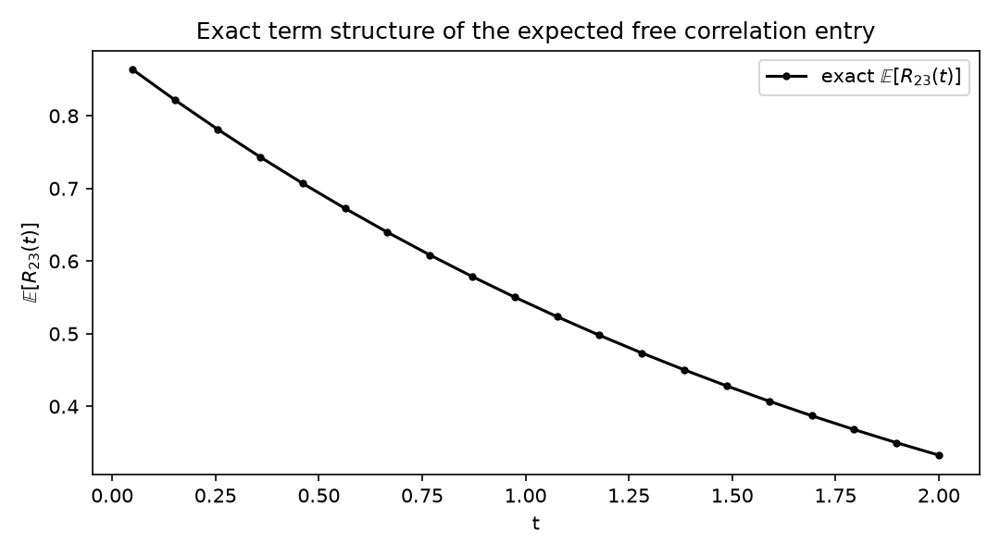

**Mathematics Subject Classification (2020):** 60H10, 60J60, 91G20,
65D32.

**JEL classification:** G13, C63.

# Introduction {#sec-introduction}

A correlation matrix must live on the compact set of symmetric positive-
semidefinite matrices with unit diagonal. The two audited strategies for
building *processes* there pull in opposite directions. Jacobi-type
diffusions respect an SDE but need parameter restrictions to keep the
boundary unreachable and yield no closed-form entry laws. Angle
parameterizations — Rebonato–Jäckel's spherical rows [@rebonato1999] and
the canonical triangular refinement of @rbm2002 — guarantee admissibility
by construction but were conceived as *static* calibration tools.

The Phase-Gram construction takes the second route dynamic: drive every
canonical angle by its own Brownian motion. Admissibility survives tautologically, and — the new content — **exactness** arrives free:
Gaussian angles make the whole matrix exactly finitely-dimensional-law'd.

# Construction {#sec-construction}

## Triangular angles

For $n$ assets, let $d=n(n-1)/2$ angles $\theta_{i,j}$, $i>j$. Rows of the
Cholesky factor $B$ are spherical coordinates:

$$
b_{i,k}=\cos\theta_{i,k}\prod_{m<k}\sin\theta_{i,m},\qquad
b_{i,i}=\prod_{m<i}\sin\theta_{i,m},
$$

and $R=B B^\top$. For $n=3$: $x_1=e_1$,
$x_2=(\cos\alpha,\sin\alpha,0)$,
$x_3=(\cos\beta,\sin\beta\cos\gamma,\sin\beta\sin\gamma)$, so

$$
R_{23}=\cos\alpha\cos\beta+\sin\alpha\sin\beta\cos\gamma .
$$

## Dynamics

$$
d\theta_{ij}=\sigma_{ij}\,dW_{ij},\qquad \text{independent across pairs.}
$$

**Proposition (admissibility).** *$R_t$ is symmetric, PSD, and unit-
diagonal for every angle configuration and every $t$; minimum eigenvalues
over 2,000 random draws are at machine zero.*

**Theorem (exact finite-time law).** *$\theta_T$ is jointly Gaussian with
independent coordinates, hence for any measurable $h$,*
$$E[h(R_T)] = \int h(R(\theta))\,\bigotimes_{k=1}^{d}\varphi(d\theta_k),$$
*a product Gauss–Hermite rule in $d$ dimensions. Pairwise marginals are
closed form:* $R_{12}(T)=\cos\Theta$ *with*
$\Theta\sim N(\theta_0,\sigma^2T)$*, so* 
$E[R_{12}(T)]=e^{-\sigma^2T/2}\cos\theta_0$ *and*
$E[R_{12}^2]=\tfrac12(1+e^{-2\sigma^2T}\cos2\theta_0)$.

## Induced entry dynamics

Itô's lemma gives explicit drifts; for the free three-asset entry,

$$
\mu_{R_{23}}=-\tfrac12(\sigma_\alpha^2+\sigma_\beta^2)\,R_{23}
-\tfrac12\sigma_\gamma^2\sin\alpha\sin\beta\cos\gamma :
$$

entries mean-revert through curvature **without any reversion parameter**
— the trigonometric boundedness does the work that Jacobi repulsion
parameters do elsewhere.

# Verification {#sec-verification}

| check | result |
|---|---|
| PSD / unit diagonal / symmetry | machine zero / 1e-12 / exact |
| deterministic limit equals static RBM map | exact |
| $R_{23}$ entry identity vs general map | $10^{-12}$ |
| $E[R_{12}]$, sd: closed form vs MC (300k) | within 1 SE |
| $E[R_{23}]$, sd: GH(30/dim) vs MC | within ~1 SE |
| short-horizon drift, three states, 400k paths each | analytic vs empirical ≤3rd decimal |

Analytic-vs-MC drift comparison:

| start $(\alpha,\beta,\gamma)$ | empirical | analytic |
|---|---|---|
| (0.3, −0.2, 0.5) | −0.4316 | −0.4298 |
| (1.0, 0.8, −0.6) | −0.5589 | −0.5594 |
| (−0.9, 0.4, 1.2) | −0.2212 | −0.2039 |

# Correlation-matrix derivatives {#sec-derivatives}

European payoffs on entries price as deterministic product quadratures
(@tab-calls):

| strike $K$ | call on $R_{23}(T)$: GH | MC (SE) |
|---|---|---|
| −0.2 | 0.77088 | 0.77159 (0.00070) |
| 0.0 | 0.59329 | 0.59381 (0.00063) |
| +0.2 | 0.42673 | 0.42727 (0.00053) |
| +0.4 | 0.27566 | 0.27601 (0.00041) |
| +0.6 | 0.14564 | 0.14598 (0.00028) |

Digital $R_{23}(T)\ge0.4$: 0.71248 vs MC 0.70950. Kinked payoffs converge
polynomially (20→40 nodes differ by 2.4e-4). The exact term structure of
$E[R_{23}(t)]$ follows from the same machinery (@fig-term).

{#fig-term}

# Related literature {#sec-related}

@rebonato1999 introduced the angles for rank reduction and noted their
unconditional admissibility; @rbm2002 canonicalized them ("triangular
angles", one-to-one with $M(M-1)/2$ parameters) for static calibration in
the LIBOR market model. Brigo–Mercurio's "the basis goes stochastic" makes
basis volatilities stochastic but prices by simulation. Jacobi matrix
diffusions [@ahdida2013] admit exact schemes but not entry laws. None of
the audited sources drives the canonical angles with independent
Gaussians, and none claims exact finite-time laws or deterministic
correlation-derivative pricing.

# Limitations {#sec-limitations}

Product-rule Gauss–Hermite costs $O(n_{\text{pts}}^d)$: comfortable to
$d=4$–5 assets; beyond that, sparse grids or the Monte Carlo benchmark
route take over. Angle volatilities are free parameters — calibrating them
to quoted correlation derivatives is now a likelihood problem on
closed-form prices, which we flag as the natural continuation. The
Gaussian driver has no stationary law; long horizons are diffusive by
design.

# Conclusion {#sec-conclusion}

One line of dynamics — independent Brownian angles — converts a static
parameterization into the first correlation-matrix process whose entire
European law is a quadrature. Constraint-free admissibility, closed-form
marginals, analytic drifts, and deterministic pricing arrive together.

# Reproducibility {#sec-repro}

Environment: conda `phase3-paper` (Python 3.12.13, numpy 2.5.1, scipy
1.18.0). Notebook `notebooks/phase10_matrix.ipynb` (~8 s, seed 20260821);
module `phase10_matrix.py`; tests `tests/test_phase10_matrix.py` (11/11).
