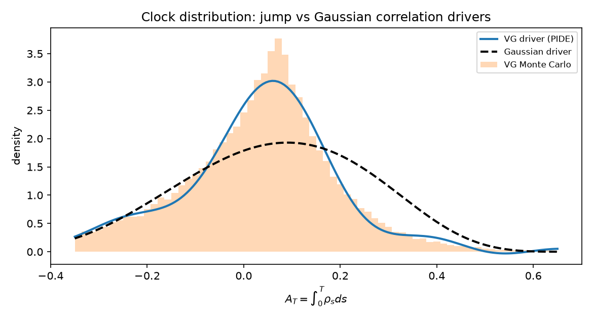

**Mathematics Subject Classification (2020):** 60H10, 60G51, 91G20,
65N30.

**JEL classification:** G13, C63.

# Introduction {#sec-introduction}

Jump-driven correlation is empirically plausible — dependence breaks in
crashes — yet the audited stochastic-correlation literature contains no
Lévy-driven model: hyperbolic-OU families [@teng2016] are Gaussian to the
core, and affine jump models price returns or volatilities, not a bounded
dependence coordinate. This paper builds the missing object and maps,
exactly, which laws of the Gaussian theory transfer.

Driver: $X_t=x_0+b\,t+L_t$ with $L$ variance-gamma or NIG; factor
$\rho_t=X_t/\sqrt{X_t^2+c^2}$.

# What survives {#sec-survival}

## Marginal laws: exact

$\rho_T=f(x_0+L_T)$ pushes the closed-form Lévy law through the monotone
Jacobian $c(1-\rho^2)^{-3/2}$. With $\psi(u)$ the log-characteristic
exponent,

$$
P(\rho_T\ge\rho^*)=1-\Big[\tfrac12-\tfrac1\pi\int_0^\infty
\operatorname{Im}\big(e^{-iu x^*}e^{T\psi(u)}\big)\frac{du}{u}\Big],
$$

$x^*=x(\rho^*)-x_0$: exact up to quadrature tolerance. Verified against
exact samplers (VG via gamma subordination with $E[G_t]=t$; NIG via
inverse-Gaussian subordination) at all quartiles within 0.01.

## Clock transform: exact via backward FK-PIDE

For time-*homogeneous* drivers the semigroup is translation-invariant, so
the backward equation is legitimate — the failure documented for
deterministic coefficient curves is a time-dependence phenomenon:

$$
\partial_tu=b\,\partial_xu+\int\!\big[u(x+y)-u(x)-y\partial_xu\,
1_{|y|<1}\big]\nu(dy)+q(x)u,\qquad u(0,x)=1 .
$$

We solve on localized grids with implicit Euler and **one precomputed LU**
(the operator is time-independent). Infinite activity: exclude a single
grid step, folding its mass into a compensating drift
$b_{\text{eff}}=b-m_1(\epsilon)$ and an effective diffusion
$\tfrac12\sigma_\epsilon^2\partial_{xx}$,
$\sigma_\epsilon^2=\int_{|y|<\epsilon}y^2\nu(dy)$ — for NIG this term
carries most of the process variance at practical grid spacings and is not
optional. Two implementation bugs caught by our own anchors are recorded
in @sec-anchors.

## Barrier laws: dead

Reflection requires continuous paths; jumps cross levels without
touching. Barrier pricing under jumps needs absorbing-type PIDEs — noted
as the honest casualty, out of scope here.

# Closed-form anchor {#sec-anchor}

With linear potential $f(x)=x$, stochastic Fubini gives

$$
E\Big[e^{iu\int_0^TX_sds}\Big]
=\exp\Big(iu(x_0T+bT^2/2)+T\int_0^1\psi(uT(1-r))\,dr\Big),
$$

an independent correctness target for the PIDE solver (agreement within
0.01 after discretization) — and, in the tiny-jump limit, recovery of the
Gaussian forward-FK solver of the companion paper (<0.02).

# Findings {#sec-findings}

Variance-matched comparison at $T=1$, $c=1$, $b=0.15$ (@tab-clocks):

| $\xi$ | Gaussian | VG PIDE (MC) | NIG PIDE (MC) |
|---|---|---|---|
| 0.5 | +0.9949+0.0334j | +0.9960+0.0092j (+0.9960+0.0087j) | +0.9948−0.0243j (+0.9949−0.0220j) |
| 1.0 | +0.9796+0.0660j | +0.9841+0.0187j (+0.9840+0.0177j) | +0.9793−0.0478j (+0.9798−0.0432j) |
| 2.0 | +0.9204+0.1255j | +0.9384+0.0388j (+0.9383+0.0369j) | +0.9196−0.0895j (+0.9214−0.0807j) |

1. **Halved clock mean**: VG with $\theta=-0.12$ gives
   $E[A_T]=0.0350$ vs Gaussian $0.0730$ — marginal calibration of the
   driver does not pin down path-dependent correlation risk.
2. **Sign flip**: NIG with $\beta=-2$ makes
   $\operatorname{Im}\phi_A(\xi)<0$: negative average correlation from a
   driver whose marginals match a positive-correlation Gaussian
   specification (@fig-clock).

{#fig-clock}

# Implementation anchors {#sec-anchors}

Two silent-corruption bugs were caught by requiring samplers and exponents
to agree: (i) the gamma subordinator's scale parameter must be $\nu$ (so
$E[G_t]=t$), not unity; (ii) exponent functions are *characteristic*
exponents — real arguments are frequencies, and passing imaginary
arguments silently produced real-valued garbage. We also record that a
gradient-compensation term added on top of shifted convolution weights
double-counts the truncated first moment and biases the process mean by
exactly the Lévy-mean contribution. These are exactly the failure classes
that marginal-only validation misses.

# Related literature {#sec-related}

Lévy-driven stochastic volatility is standard (Bates; NIG-GARCH); Lévy
drivers of a *bounded dependence coordinate* are absent from the audited
corpus. FK integro-differential theory is classical [@sato1999];
Gil–Pelaez inversion and small-jump approximations are standard tools;
our contribution is their assembly into an exact pricing stack for
correlation, plus the survival/collapse analysis.

# Conclusion {#sec-conclusion}

Jumps cost the reflection toolkit but not the transform stack. The
practical message is sharp: calibrating a correlation model's marginals —
under any driver — says almost nothing about its path-dependent risk, and
jump asymmetry moves the latter by economically large factors.

# Reproducibility {#sec-repro}

Environment: conda `phase3-paper` (Python 3.12.13, numpy 2.5.1, scipy
1.18.0). Notebook `notebooks/phase11_levy.ipynb` (~321 s, seed 20260821);
module `phase11_levy.py`; tests `tests/test_phase11_levy.py` (9/9).
