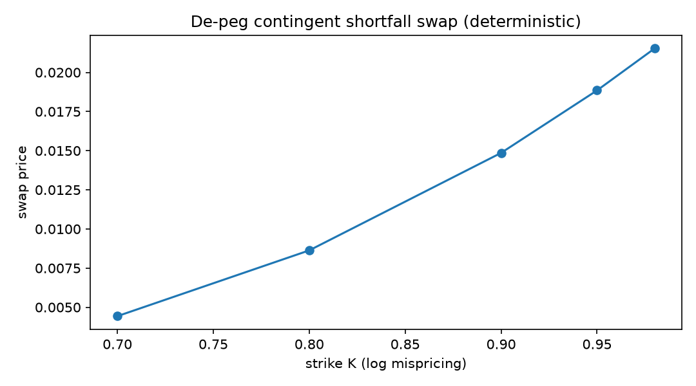

**Mathematics Subject Classification (2020):** 91G20, 91B70, 60J60,
60G40.

**JEL classification:** G13, G15, E42, F31.

# Introduction {#sec-introduction}

De-peg events are tail events with derivatives written on them: exchanges
list stablecoin de-peg digitals and shortfall-style payouts, and post-mortems
of USDC, Terra, and the 1992 ERM crises document their severity. The
audited literature splits into empirical event studies and Krugman-type
target-zone theory [@krugman1991]; neither prices a book of de-peg
contingent claims under an explicit stochastic credibility mechanism.

This paper supplies such a mechanism with a fully deterministic pricing
stack, assembled from three exact pieces: defended-band reflection, a
bounded-factor credibility clock, and Gaussian free-float continuation.

# Model {#sec-model}

## Defended band

While credible ($t<\tau$), the log-mispricing $Y_t=\log(P_t/\text{parity})$
is regulated Brownian motion on $[-\ell,h]$:

$$
dY_t=b\,dt+\sigma\,dW_t+dL_t-dU_t ,
$$

$L,U$ pushing at the edges. The stationary law is the exponential
trapezoid $\pi(y)\propto e^{2by/\sigma^2}$ — uniform at zero drift
(recovered to quadrature precision), tilted toward the intervention edge
otherwise.

## Credibility clock

Independently,

$$
dZ_t=\lambda\sigma_z^2\,dt+\sigma_z\,dW^z_t,\qquad
C_t=f(Z_t)=Z_t/\sqrt{Z_t^2+c^2},\qquad
\tau=\inf\{t:C_t\ge c_*\}.
$$

This is exactly the Milestone-1 bounded-factor first-passage problem:
with $\Delta=x(c_*)-x(C_0)$ and $\lambda<0$ (deteriorating credibility),

$$
P(\tau\le T)=\Phi\!\Big(\frac{\lambda v(T)-\Delta}{\sqrt{v(T)}}\Big)
+e^{2\lambda\Delta}\Phi\!\Big(-\frac{\lambda v(T)+\Delta}{\sqrt{v(T)}}\Big),
\qquad v(T)=\sigma_z^2T,
$$

perpetual mass $e^{2\lambda\Delta}$, and calendar-time IG density
$f_\tau(t)=f_u(v(t))\,\sigma_z^2$.

## Pay-at-hit transform

Since $\tau_{\text{cal}}=u^*/\sigma_z^2$ with $u^*$ the operational-time
hitting time of drifted Brownian motion $(\lambda,B)$,

$$
E[e^{-r\tau};\tau<\infty]
=\exp\Big((\lambda-\sqrt{\lambda^2+2r/\sigma_z^2})\,\Delta\Big):
$$

the raw drift coefficient $\lambda$ appears directly and the discount rate
enters only scaled — a compact formula verified against exact-density
quadrature to $10^{-6}$ after two sign/scale errors were caught by our own
anchors (recorded honestly in @sec-bugs).

## Free float and contingent claims

After $\tau$, $\log P_T=y_{\text{exit}}+\mu_f(T-s)+\sigma_f\sqrt{T-s}\,Z$
from the exit edge. The shortfall swap

$$
V=e^{-rT}\int_0^T f_\tau(s)\;
E\big[(K-e^{y_{\text{exit}}+\mu_f(T-s)+\sigma_f\sqrt{T-s}Z})^+\big]\,ds
$$

prices by ONE quadrature over the exact IG density times Gauss–Hermite on
the Gaussian component — no simulation anywhere on the pricing path.

# Results {#sec-results}

Reference calibration: band $[-2\%,+3\%]$; $\lambda=-0.25$,
$\sigma_z=0.9$, $c=1.1$, $C_0=0.3\to c_*=0.85$; $r=5\%$;
$\mu_f=-15\%$, $\sigma_f=35\%$.

| horizon | $P(\tau\le T)$ | digital | 
|---|---|---|
| 0.5y | 0.01714 | 0.01671 |
| 1y | 0.07726 | 0.07349 |
| 2y | 0.17785 | 0.16093 |
| 5y | 0.31713 | 0.24698 |

Concavity is pronounced and perpetual-capped: long-dated digitals can never
exceed $e^{2\lambda\Delta}=48.9\%$ discounted — exponential-hazard
specifications, which integrate to one, systematically overprice them.

Shortfall swaps at $T=2$ (@fig-shortfall):

| K (% of parity) | price |
|---|---|
| 70 | 0.004430 |
| 80 | 0.008631 |
| 90 | 0.014859 |
| 95 | 0.018850 |
| 98 | 0.021529 |

Simulation check: 200k paths, perpetual-mass-corrected inverse-transform
sampling of $\tau$, projection-reflected band paths, exact free
continuation — de-peg frequency 0.17800 vs exact 0.17785 (SE 0.00086).

{#fig-shortfall}

# Two implementation warnings {#sec-bugs}

Both were caught by requiring closed forms and simulations to agree:

1. **Operational-time accounting**: mixing calendar drift
   $\lambda\sigma_z^2$ with operational-time variance produces wrong
   Laplace transforms; the correct derivation works entirely in
   operational time where the drift is the raw $\lambda$ and variance is
   unit, then maps discounts through $r\to r/\sigma_z^2$.
2. **Hazard sampling**: normalizing the truncated hazard CDF to one
   rescales the uniforms and silently multiplies event frequencies by
   $1/\text{(perpetual mass)}$. Invert the *raw* CDF and mask uniforms at
   the perpetual probability.

# Related literature {#sec-related}

Target zones [@krugman1991] value credible bands via smooth pasting but
carry no stochastic credibility hazard and no contingent stack; speculative-
attack models are qualitative about timing; stablecoin de-peg studies are
empirical. First-passage Laplace transforms and reflected Brownian
stationary laws are classical tools we assemble, not contributions;
the contribution is the two-factor coupling with its deterministic
derivative stack and the falsifiable concavity prediction.

# Conclusion {#sec-conclusion}

A peg is a derivative on its own credibility. Once credibility is modeled
as a bounded factor, every de-peg instrument prices in closed form or a
single quadrature — and the resulting term structures carry a testable
signature (perpetual-mass concavity) that distinguishes the mechanism from
memoryless hazards.

# Reproducibility {#sec-repro}

Environment: conda `phase3-paper` (Python 3.12.13, numpy 2.5.1, scipy
1.18.0). Notebook `notebooks/phase12_peg.ipynb` (~3 s, seed 20260821);
module `phase12_peg.py`; tests `tests/test_phase12_peg.py` (7/7).
