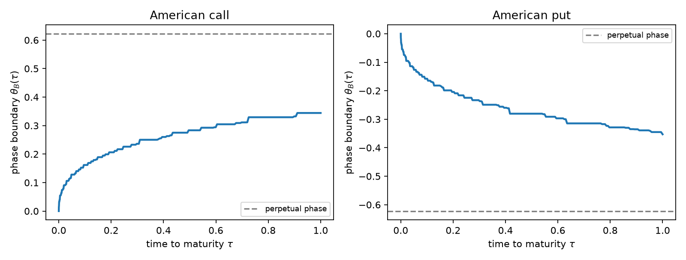
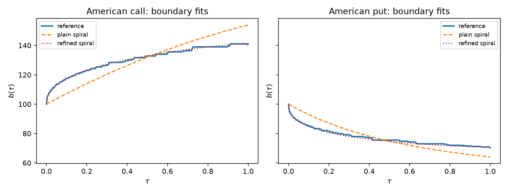
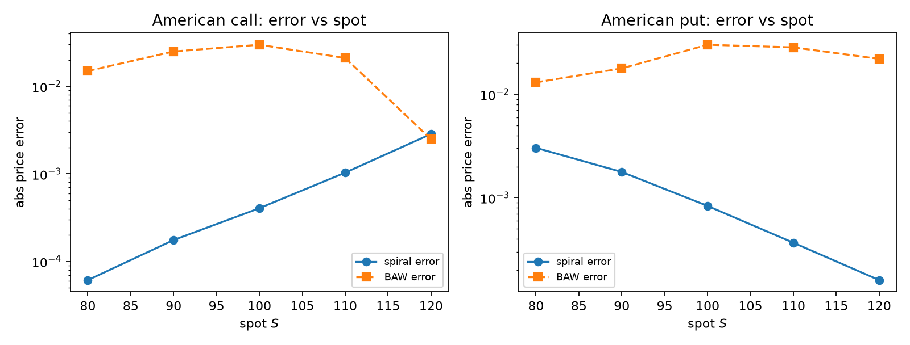
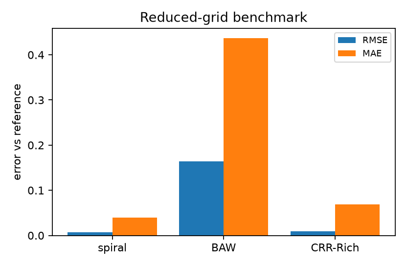

# Introduction {#sec-introduction}

The American option problem under Black–Scholes–Merton (BSM) assumptions
with a continuous dividend yield $q\ge0$ has resisted closed-form solution
for half a century. Merton's observation that the American call with
$q=0$ is worth exactly its European counterpart [@merton1973] is the
exception that proves the rule: with $q>0$ (or for the put with any
$r>0$) early exercise becomes optimal, and the price is determined by a
free boundary — the critical stock price $b(t)$ below which (put) or
above which (call) immediate exercise is optimal. Kim derived the
early-exercise-premium (EEP) representation and showed that the boundary
solves a nonlinear Volterra integral equation [@kim1990]; Jacka and
Carr–Jarrow–Myneni established the same representation independently
[@jacka1991; @carrjarrowmyneni1992]. Practical pricing has since relied
on trees, finite differences, Monte Carlo, and analytic approximations —
most famously the quadratic approximation of Barone-Adesi and Whaley
[@baroneadesiwhaley1987] and the multipiece exponential boundary of Ju
[@ju1998].

This paper starts from a different object. The Phase 4 construction of
this research program [@phase4paper] is the one-driver complex process

$$
\mathcal Z_t
=
\mathcal Z_0
\exp\!\left(
\left[\left(\mu-\frac12\sigma^2\right)+i\omega\right]t
+(\sigma+i\beta)W_t
\right),
$$ {#eq-complex-gbm}

whose modulus satisfies $d|\mathcal Z_t|/|\mathcal Z_t|=\mu\,dt+\sigma\,dW_t$:
it is *exactly* geometric Brownian motion. Under the risk-neutral measure
with $\mu=r-q$, the modulus is the BSM stock price $S_t$, and the phase
lift is

$$
\Theta_t=\Theta_0+\omega t+\beta W_t
=\Theta_0+\frac{\beta}{\sigma}\ln\frac{S_t}{S_0}
+\left[\omega-\frac{\beta}{\sigma}\left(r-q-\frac12\sigma^2\right)\right]t.
$$ {#eq-phase}

In the drift-matched gauge (the bracket vanishes) the phase is a pure
scale of the log-price, and the American free-boundary problem becomes a
**moving phase-barrier problem**: the call exercise region
$\{S_t\ge b(t)\}$ is the phase half-space $\{\Theta_t\ge\theta_B(t)\}$
with $\theta_B(t)=\Theta_0+(\beta/\sigma)\ln(b(t)/S_0)$. We use this
geometry to do three things.

**First (exact reference).** We implement the EEP representation and the
Volterra boundary equation as a stable *causal level-set solver*
(@sec-reference). Two structural facts organize the numerics: for the
call, the value-matching residual $F(y;\tau)$ satisfies $F(y;\tau)<0$ for
$y<b(\tau)$ and $F(y;\tau)=0$ for **all** $y\ge b(\tau)$ — the residual
*reaches* zero rather than crossing it (@sec-structure) — and the
equation loses traction as $\tau\downarrow0$, where the maturity anchor
takes over. The reference prices reproduce published 10,000-step binomial
benchmark values and obey put–call symmetry (@sec-validation).

**Second (geometry of the boundary).** The reference solutions expose the
short-maturity law of the boundary: an infinite-slope approach with the
universal *shape* $\sqrt{\tau|\ln\tau|}$ and an effective coefficient
that depends on $r-q$ at accessible maturities (@sec-asymptotics). No
finite-slope ansatz (in particular, no plain exponential spiral) can
reproduce it.

**Third (the Phase 15 formula).** Guided by the phase picture, we define
the logarithmic-spiral boundary family, exact at *both* asymptotic
limits — the maturity anchor and the perpetual boundary — refined by the
short-maturity asymptotic term (@sec-spiral). Its three remaining
parameters are fixed by collocation of the value-matching residual; no
boundary fitting appears anywhere. The resulting price — European
Black–Scholes plus one EEP integral over an explicit integrand — is a
fast closed-form-class formula. On a 90-configuration benchmark grid it
beats Barone-Adesi–Whaley by roughly an order of magnitude in RMSE and
is on par with, or better than, Richardson-extrapolated binomial trees
(@sec-results).

### Novelty boundary {#sec-novelty}

*Claimed as new:* the phase-barrier reformulation of the BSM free-boundary
problem on the Phase 4 complex GBM; the causal level-set reference solver
and its structural diagnostics (residual plateau, traction loss,
$\sqrt{\tau|\ln\tau|}$ shape); the logarithmic-spiral boundary family
anchored exactly at both limits; the collocation-fixed pricing formula and
its benchmark performance. *Not claimed:* the EEP representation
[@kim1990; @jacka1991; @carrjarrowmyneni1992], the maturity anchors
[@kim1990], the perpetual closed form (McDonald–Schroder, via
@merton1973-style ODE roots), quadratic or multipiece approximations
[@baroneadesiwhaley1987; @macmillan1986; @ju1998], or any closed form for
the true boundary — the constant-coefficient free-boundary problem remains
open, and this paper does not claim to solve it.

# Exact machinery {#sec-machinery}

## Risk-neutral dynamics and European baseline

Under the risk-neutral measure $\mathbb Q$,

$$
\frac{dS_t}{S_t}=(r-q)\,dt+\sigma\,dW_t,
$$ {#eq-dynamics}

and the European price with dividend yield is the standard
Merton-adjusted Black–Scholes formula, which we write as
$V_E(S,K,\tau;\phi)$ with $\phi=+1$ for calls and $\phi=-1$ for puts.
Put–call parity reads
$c-p=S e^{-q\tau}-K e^{-r\tau}$, and the American call with $q=0$
reduces exactly to the European call [@merton1973].

## Early-exercise-premium representation {#sec-eep}

Let $V$ be the American price and $\tau=T-t$. Applying Itô's formula to
$e^{-rt}V(S_t,t)$ and using that $V$ solves the BSM PDE in the
continuation region and $V=\phi(S-K)$ in the exercise region gives, with
$B(u)$ the boundary in calendar time [@kim1990; @jacka1991;
@carrjarrowmyneni1992],

$$
V_A(S_t,t)=V_E(S_t,t)+\int_t^T e^{-r(u-t)}
\,\mathbb E_t^{\mathbb Q}\!\left[
\big(qS_u-rK\big)\,\mathbf 1_{\{S_u\ge B(u)\}}\right]du
$$ {#eq-eep-call}

for the call, with the integrand
$(rK-qS_u)\mathbf 1_{\{S_u\le B(u)\}}$ for the put. Evaluating the
conditional expectations in closed form yields the working representation
used throughout: with $b(\tau)$ the boundary as a function of time to
maturity,

$$
\boxed{
V_A(S,\tau)=V_E(S,\tau)+\int_0^\tau
\Big[
qS e^{-qs}\Phi\!\big(\phi d_1(S,b(\tau-s),s)\big)
-rK e^{-rs}\Phi\!\big(\phi d_2(S,b(\tau-s),s)\big)
\Big]ds
}
$$ {#eq-eep}

for the call ($\phi=+1$); the put ($\phi=-1$) carries $\Phi(-d_1),\Phi(-d_2)$
with the two terms interchanged in sign, and

$$
d_{1,2}(S,B,s)=
\frac{\ln(S/B)+(r-q\pm\frac12\sigma^2)s}{\sigma\sqrt s}.
$$ {#eq-d12}

Three properties of @eq-eep are essential for what follows.

1. **Stationarity.** The price is stationary to first order under
   boundary perturbations (envelope property of the optimal stopping
   problem): a boundary approximation with small error produces a
   *second-order* price error. This is why a coarse-boundary formula can
   price accurately.
2. **Causality.** The integral at time to maturity $\tau$ involves the
   boundary only at arguments $<\tau$. The boundary equation can be
   solved sequentially from $\tau=0$ upward.
3. **Degeneracy above the boundary (call).** For $y\ge b(\tau)$,
   immediate exercise is optimal, so the representation reproduces the
   intrinsic value identically:
   $(y-K)=V_E(y,\tau)+\mathrm{EEP}(y,\tau)$. Hence the value-matching
   residual $F(y;\tau):=(y-K)-V_E(y,\tau)-\mathrm{EEP}(y;\tau)$ satisfies
   $F<0$ for $y<b(\tau)$ and $F\equiv0$ for $y\ge b(\tau)$: the boundary
   is where the residual *reaches* zero. The put mirrors this with a
   positive hump and $F\to-\infty$.

## Boundary integral equation and anchors {#sec-anchors}

Evaluating @eq-eep at the boundary ($S=b(\tau)$, value matching) gives
the nonlinear Volterra equation

$$
\phi\big(b(\tau)-K\big)
=
V_E(b(\tau),\tau)+
\int_0^\tau
\Big[
q\,b(\tau)e^{-qs}\Phi\big(\phi d_1(b(\tau),b(\tau-s),s)\big)
-rK e^{-rs}\Phi\big(\phi d_2(b(\tau),b(\tau-s),s)\big)
\Big]ds,
$$ {#eq-volterra}

whose solution is the exercise boundary. The equation is anchored at both
ends of the maturity axis:

- **At maturity** (Kim 1990; Jacka 1991): exercising the call at spot $S$
  just before expiry gains the dividend flow $qS$ against the interest
  $rK$ on the strike, so
  $$b_c(0^+)=K\max(1,r/q) \quad(q>0),\qquad
  b_p(0^+)=K\min(1,r/q),$$ {#eq-anchors}
  with $b_c(0^+)=\infty$ when $q=0$ (never exercise);
- **At infinity** the perpetual McDonald–Schroder closed form: with
  $s_\pm$ the roots of
  $\frac12\sigma^2 s(s-1)+(r-q)s-r=0$,
  $$
  b_\infty^{\mathrm{call}}=K\frac{s_+}{s_+-1},\qquad
  b_\infty^{\mathrm{put}}=K\frac{s_-}{s_--1},
  $$ {#eq-perpetual}
  and the corresponding perpetual prices.

# Reference solver and validation {#sec-reference}

## Causal level-set scheme {#sec-solver}

We solve @eq-volterra on a mildly clustered grid
$\tau_i=T(i/n)^{3/2}$, sequentially in $i$. At step $i$ the history
$b(\cdot)$ on $[0,\tau_{i-1}]$ is known; the residual
$F(y;\tau_i)$ is evaluated by Gauss–Legendre quadrature with history
interpolation, and $b(\tau_i)$ is located as the solution of
$F(y;\tau_i)=-\delta K$ (a genuine crossing, since $F$ only *reaches*
zero), corrected linearly back toward the zero level, inside an adaptive
scan window of width $\sim8\sigma\sqrt{\tau_i}$ around the previous
boundary. The level $\delta>0$ is needed because exactly at the zero
level the call problem is one-sided. The scheme respects the degeneracies
documented in @sec-eep: the $\tau\downarrow0$ points, where
$\partial F/\partial y\to0$, are pinned to the anchor @eq-anchors rather
than solved.

## Validation {#sec-validation}

All checks below use the implementation of @sec-solver; the executable
record is the Phase 15 notebook (@sec-repro).

**Published benchmark values.** Ju's exhibits report "true" prices from
10,000-step binomial trees [@ju1998]. Our reference reproduces them:

| Case | Reference | TRUE (10,000-step) | $|\Delta|$ |
|------|-----------|--------------------|------------|
| Put, $S{=}K{=}40$, $r{=}0.0488$, $q{=}0$, $\sigma{=}0.2$, $T{=}0.5833$ | 1.9905 | 1.990 | $4.6\times10^{-4}$ |
| Call, $S{=}K{=}100$, $r{=}0.03$, $q{=}0.07$, $\sigma{=}0.4$, $T{=}0.5$ | 10.237 | 10.239 | $2.2\times10^{-3}$ |

**McDonald–Schroder symmetry.**
$P(S,K,r,q,\sigma,\tau)=C(K,S,q,r,\sigma,\tau)$ holds to
$2.4\times10^{-3}$ with independently solved boundaries
($r{=}0.07,q{=}0.03,\sigma{=}0.2,T{=}1$).

**Cross-method.** Richardson-extrapolated CRR trees
($N\in\{1500,3000,6000\}$) agree with the reference to
$\le7\times10^{-4}$ at the ATM point; implicit log-space finite
differences agree to $\sim3\times10^{-3}$ on coarser grids.

**Value matching.** Sampled residuals of the solved boundary satisfy
$|F(b(\tau_i),\tau_i)|\lesssim10^{-2}$ on the $K=100$ scale — the
remaining error budget is dominated by the one-sided level-set bias
$O(\sqrt{\delta K})$, benign for prices by stationarity.

# Geometry of the boundary {#sec-asymptotics}

## Phase-barrier picture {#sec-phase-picture}

In the drift-matched gauge of @eq-phase, the boundary is the phase curve
$\theta_B(t)=\Theta_0+(\beta/\sigma)\ln(b(T-t)/S_0)$
(@fig-phase-boundary): calls exercise above the curve, puts below it,
and both curves run from the maturity anchor to the horizontal
*perpetual phase line* $\theta_\infty$. The Phase 4 rank-one structure
(both radius and phase driven by one $W$) is precisely what makes the
barrier a *curve* rather than a surface: the exercise decision is a
one-dimensional first-passage question in the phase coordinate.

{#fig-phase-boundary}

## Short-maturity shape {#sec-shape}

Fitting $b(\tau)=b_0+\eta\,c\,\sigma b_0\sqrt{2\tau|\ln\tau|}$ to the
reference boundary on $\tau\in(0,0.02)$ gives the coefficients in
@tbl-coeffs. Two facts stand out.

| $r$ | $q$ | $\sigma$ | kind | $c$ |
|-----|-----|----------|------|-----|
| 0.05 | 0.05 | 0.2 | call | 1.13 |
| 0.05 | 0.05 | 0.2 | put | 1.04 |
| 0.07 | 0.03 | 0.2 | call | 0.24 |
| 0.07 | 0.03 | 0.2 | put | 0.73 |
| 0.03 | 0.07 | 0.2 | call | 0.77 |
| 0.03 | 0.07 | 0.2 | put | 0.24 |
| 0.05 | 0.05 | 0.4 | call | 1.18 |
| 0.05 | 0.05 | 0.4 | put | 0.99 |

: Short-maturity coefficient fits $b(\tau)=b_0+\eta c\sigma b_0\sqrt{2\tau|\ln\tau|}$ on $\tau\le0.02$. {#tbl-coeffs}

1. The **shape** $\sqrt{\tau|\ln\tau|}$ — infinite slope at maturity —
   is universal. Any finite-slope ansatz (plain exponential spirals
   included) fails to reproduce the boundary near $\tau=0$.
2. The **coefficient** is near $1$ only in the zero-drift case
   $r=q$; nonzero $r-q$ shifts it substantially (down to $\approx0.24$
   in the table). Whether the zero-drift value is the true leading
   constant or the first term of a slowly convergent correction cannot
   be resolved on accessible windows; either way the practical
   coefficient is parameter-dependent.

The second fact is a design input: the Phase 15 family keeps the shape
exactly and lets collocation fix the effective coefficient.

# The logarithmic-spiral boundary family {#sec-spiral}

## Definition and limits {#sec-limits}

Let $b_0=b(0^+)$ be the maturity anchor @eq-anchors and $b_\infty$ the
perpetual boundary @eq-perpetual. The **refined spiral boundary** is

$$
\boxed{
\ln b(\tau)
=
\ln b_\infty+\ln\!\left(\frac{b_0}{b_\infty}\right)e^{-\kappa_1\tau}
+\eta\,\sigma\sqrt{2\tau\,\big|\ln\max(\tau,\varepsilon)\big|}\,
e^{-\kappa_2\tau}
}
$$ {#eq-spiral}

with $\varepsilon$ a tiny cutoff, $\eta>0$ for calls and $\eta<0$ for
puts. The first two terms are the plain logarithmic spiral: in the
phase-time plane the boundary winds toward the perpetual phase line with
exponential rate $\kappa_1$ — the geometric object singled out by
@sec-phase-picture. The third term adds the short-maturity asymptotic
shape with exponential cutoff $\kappa_2$. By construction,

$$
b(0^+)=b_0,\qquad \lim_{\tau\to\infty}b(\tau)=b_\infty,
$$ {#eq-limits}

for all parameter values: the family is anchored exactly at both
asymptotic limits. @fig-spiral-fit compares best-fit members against the
reference boundary; the refined family reduces the relative $L^\infty$
boundary error by factors of $2$–$10$ relative to the plain spiral.

{#fig-spiral-fit}

## Collocation {#sec-collocation}

The three parameters $(\kappa_1,\kappa_2,\eta)$ are fixed without any
boundary fitting: we drive the value-matching residual @eq-volterra of
the spiral boundary itself to zero at three fractional times to maturity
$(\tau_1,\tau_2,\tau_3)=(T/4,T/2,3T/4)$, by bounded least squares
(multi-start L-BFGS-B, box $10^{-3}\le\kappa_i\le60$, $0\le\eta\le2.5$).
The residual evaluations reuse the exact EEP machinery of @eq-eep with
the spiral boundary inside the integral, so the collocation is an honest
projection of the free-boundary equation onto the family — no reference
solve is involved at pricing time.

## The pricing formula {#sec-formula}

$$
\boxed{
V_A(S,\tau)
=
V_E(S,\tau)
+
\int_0^\tau
\Big[
qS e^{-qs}\Phi\big(\phi d_1(S,b(\tau-s),s)\big)
-rK e^{-rs}\Phi\big(\phi d_2(S,b(\tau-s),s)\big)
\Big]ds
}
$$ {#eq-formula}

with $b(\cdot)$ given by @eq-spiral at the collocated parameters
($\phi=+1$ call; the put uses $\Phi(-d_1),\Phi(-d_2)$). This is the
**Phase 15 spiral formula**: European Black–Scholes plus one
one-dimensional integral over a fully explicit integrand. Its limits are
correct by construction: $q=0$ calls return the European price (the
boundary is infinite, the premium vanishes); the boundary limits
@eq-limits hold at both ends of the maturity axis; and stationarity
(@sec-eep) insures the price against residual boundary error to first
order.

# Numerical results {#sec-results}

## Reduced grid (notebook) {#sec-reduced}

On 18 configurations $\times$ 3 spots ($r,q\in\{0.03,0.05,0.07\}$,
$\sigma\in\{0.2,0.4\}$, $T\in\{0.5,1,3\}$, $S\in\{90,100,110\}$, calls
and puts), errors against the reference solver:

| Method | RMSE | MAE |
|--------|------|-----|
| Spiral formula | **0.0066** | **0.039** |
| Barone-Adesi–Whaley | 0.1645 | 0.437 |
| CRR–Richardson | 0.0089 | 0.069 |

: Reduced-grid benchmark vs the reference solver. {#tbl-reduced}

@fig-spot-errors shows the spot profile for the base case: the spiral
error stays within a few $10^{-3}$ across all moneynesses where BAW
costs $10^{-2}$–$10^{-1}$.

{#fig-spot-errors}

## Extended grid {#sec-extended}

The extended run covers 90 configurations ($r,q$ in
$\{(0.05,0.05),(0.07,0.03),(0.03,0.07),(0.10,0.05),(0.05,0.10)\}$,
$\sigma\in\{0.2,0.4,0.6\}$, $T\in\{0.5,1,3\}$, both kinds) at five spots
$S\in\{80,\ldots,120\}$ — 450 prices:

| Method | RMSE | MAE |
|--------|------|-----|
| Spiral formula | **0.0160** | **0.186** |
| Barone-Adesi–Whaley | 0.285 | 1.142 |
| CRR–Richardson | 0.019 | 0.298 |

: Extended 90-configuration benchmark vs the reference solver. {#tbl-extended}

The formula is the best method against the reference in both norms:
roughly $18\times$ better than BAW in RMSE and ahead of the extrapolated
tree, while costing a bounded least-squares solve plus one quadrature —
closed-form-class speed (@fig-benchmark-summary). Errors concentrate in
long-maturity high-volatility puts ($T=3$, $\sigma=0.6$), where a single
global boundary family is most stretched; @sec-scope quantifies this.

{#fig-benchmark-summary}

## Structural identities of the formula {#sec-identities}

Verified in the notebook: the $q=0$ call returns the European price to
machine precision; the put price is monotone decreasing and convex in
$S$; and at $T=30$ the spiral put price is within $0.59$ ($2.6\%$) of the
perpetual limit $22.532$ — slow but monotone approach, consistent with
the family's exact $\tau\to\infty$ boundary limit.

# Scope and limitations {#sec-scope}

- **Not a closed form.** We do not claim a closed-form American price.
  @eq-formula is a closed-form-class expression (one bounded
  least-squares solve of three scalar equations, one smooth
  one-dimensional integral); the true free boundary remains open
  problem territory, and our own reference solver is a numerical scheme.
- **Accuracy envelope.** On the extended grid the worst errors
  ($\sim0.1$–$0.19$) occur for long-maturity ($T=3$), high-volatility,
  dividend-heavy configurations. The formula is designed for
  $T\lesssim 1$–$2$; beyond that, multipiece compositions of the family
  (piecewise collocation) or the reference solver are the appropriate
  tools.
- **Stationarity is a shield, not a license.** Boundary errors of
  several percent can price to $10^{-3}$ by stationarity, but a badly
  collocated family can still misprice; the benchmark grid is the
  operative guarantee.
- **Short-maturity coefficient.** We document the coefficient's
  $r-q$-dependence as measured; the limiting constant(s) are not
  resolved. The $\eta$ parameter makes the formula insensitive to this
  gap.
- **Model scope.** Constant $r,q,\sigma$; continuous dividends; standard
  single-asset American calls/puts. American options under the Phase 6
  stochastic-correlation framework or with discrete dividends are open
  extensions.

# Reproducibility {#sec-repro}

All computations run in the existing `phase3-paper` conda environment
(Python 3.12, numpy 2.5.1, scipy 1.18.0, matplotlib 3.11.1); no packages
were installed. Fixed seed `20260902` is recorded although no Monte
Carlo appears in the pipeline. Artifacts:

- `phase15_american.py` — exact machinery, reference solver, spiral
  formula, and benchmarks (BAW, CRR–Richardson, PDE);
- `tests/test_phase15_american.py` — 14 unit tests, all green
  (`python -m unittest tests.test_phase15_american`);
- `notebooks/build_phase15_american_spiral.py` → executed
  `notebooks/phase15_american_spiral.ipynb` — the computational record
  behind every number in this paper (figures in `phase15_figures/`,
  tables in `phase15_tables/`, including the extended benchmark CSV);
- `paper/phase15/` — this manuscript, its executed notebook copy, and
  tables.

The notebook executes top-to-bottom from a clean kernel in under one
minute.

# References
