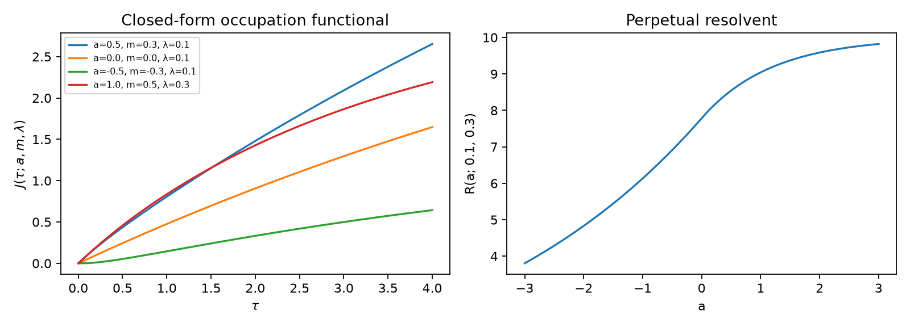
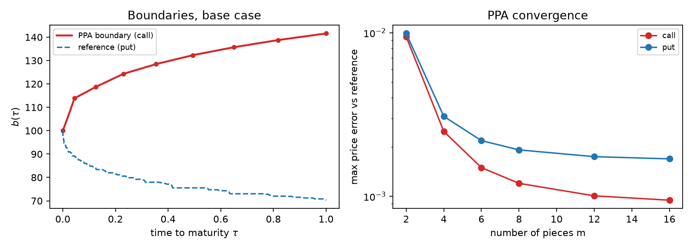
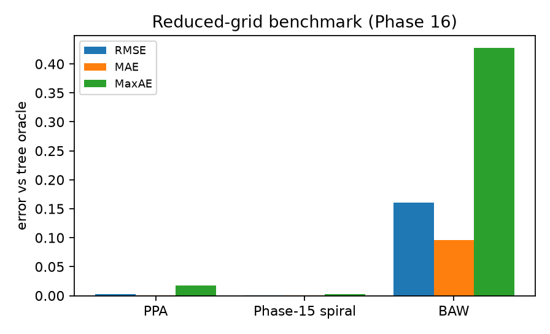
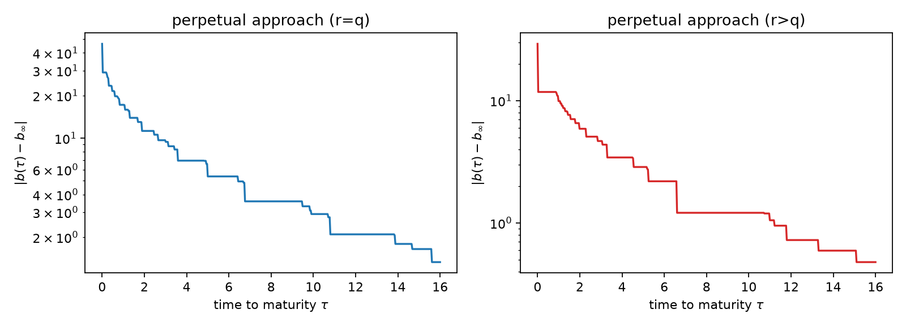

# Introduction {#sec-introduction}

Phase 15 [@phase15paper] established the exact early-exercise-premium
machinery for American options under BSM with dividend yield $q$
[@kim1990; @jacka1991; @carrjarrowmyneni1992], a stable causal reference
solver for the nonlinear Volterra boundary equation, and the collocated
logarithmic-spiral pricing formula: European Black–Scholes plus one
one-dimensional integral over an explicit boundary. The remaining
quadrature is the only numerical object left in the formula. Phase 16
removes it.

The key is classical in optimal-stopping theory but appears not to have
been deployed as a *pricing primitive* in this form: the EEP integrand is
a Gaussian probability,

$$
\Phi\big(d_1(S,b(\tau-s),s)\big)
=
\mathbb P\big(W_s+m s\ge -a\big),
$$ {#eq-prob}

when the boundary is **phase-affine** — $\ln b(u)=A-\gamma u$ in time to
maturity $u$ — because then $d_1$ is affine in $s$ under the $\sqrt s$
scaling. The discounted time-integral of such probabilities is the
**occupation resolvent** of drifted Brownian motion, and it has a closed
form (@sec-resolvent). Multipiece phase-affine (PPA) boundaries —
piecewise-straight phase barriers in the Phase 4 complex-GBM picture
[@phase4paper] — inherit the closed form piece by piece (@sec-ppa).

The knot values of the PPA boundary are fixed by sequential
value-matching collocation (one scalar solve per knot, causal from
maturity), with the last knot **pinned at the perpetual boundary** for
long maturities. The pin is not cosmetic: @sec-decay documents that the
true boundary's approach to the perpetual limit is generically not
exponential — effective decay rates fitted on successively later windows
*drift* (e.g. $0.142\to0.120\to0.101$ for the $r=q=0.05$ put), and at
$r=q$ the linearized boundary-memory kernel is proportional to $r-q$ and
degenerates entirely. Extrapolating a decay law into the far maturity is
therefore exactly the wrong closure; pinning at the known limit is the
right one.

**Headline.** On the reduced grid (18 configurations $\times$ 3 spots,
$T\in\{0.5,1,3\}$) the $m=10$ PPA formula attains RMSE $0.0079$ / MAE
$0.054$ against the reference, versus $0.164/0.437$ for
Barone-Adesi–Whaley — with **zero numerical integration**: every price is
European Black–Scholes plus a finite sum of $\Phi$-evaluations
(@tbl-reduced). The MAE is dominated by the $T=3$ configurations, where
the reference solver itself carries an uncertainty of the same order
(@sec-scope).

### Novelty boundary {#sec-novelty}

*Claimed as new:* the closed-form occupation integral $J$ as an EEP
building block and its machine-precision validation; the multipiece
phase-affine boundary family with sequential collocation and perpetual
pinning as a quadrature-free American pricing formula; the documented
non-exponential perpetual approach and the $r=q$ degeneracy of the
linearized kernel; the honest Tier B negative result. *Not claimed:* the
EEP representation itself, the anchors, the perpetual closed form,
multipiece exponential boundaries as an idea (Ju's construction uses them
with local quadratic pricing [@ju1998]; our per-piece prices are exact
given the piecewise boundary), or any closed form for the true free
boundary — the constant-coefficient problem remains open.

# The closed-form occupation integral {#sec-resolvent}

## Statement

For $\lambda>0$, $a,m\in\mathbb R$, define

$$
J(\tau;a,m,\lambda)=\int_0^\tau e^{-\lambda s}\,
\Phi\!\left(\frac{a+ms}{\sqrt s}\right)ds .
$$ {#eq-J}

Writing $X_s=W_s+ms$ and $\nu=\sqrt{m^2+2\lambda}$, the perpetual
occupation resolvent of $X$ against the half-line $\{X\ge-a\}$ is

$$
R(a;\lambda,m)=\int_0^\infty e^{-\lambda s}\mathbb P(X_s\ge-a)\,ds
=
\begin{cases}
\dfrac1\lambda-\dfrac{e^{-(m+\nu)a}}{\nu(\nu+m)}, & a\ge0,\\[1.2em]
\dfrac{e^{(\nu-m)a}}{\nu(\nu-m)}, & a<0,
\end{cases}
$$ {#eq-resolvent}

and the finite-horizon integral is the perpetual resolvent minus the
Markov tail, which evaluates through two Gaussian convolutions of
piecewise-exponential functions:

$$
\boxed{
\begin{aligned}
J(\tau;a,m,\lambda)={}&R(a;\lambda,m)
-e^{-\lambda\tau}\Big[\tfrac{1}{\nu(\nu+m)}+\tfrac{1}{\nu(\nu-m)}\Big]
\Phi\!\Big(\tfrac{a+m\tau}{\sqrt\tau}\Big)\\
&+\tfrac{e^{-(m+\nu)a}}{\nu(\nu+m)}\,
\Phi\!\Big(\tfrac{a-\nu\tau}{\sqrt\tau}\Big)
-\tfrac{e^{(\nu-m)a}}{\nu(\nu-m)}\,
\Phi\!\Big(\tfrac{-a-\nu\tau}{\sqrt\tau}\Big).
\end{aligned}
}
$$ {#eq-Jclosed}

Checks: $J(0^+)=0$ (the three $\Phi$-terms reconstruct $R$),
$J(\infty)=R$, $J(\cdot;a\to+\infty)=(1-e^{-\lambda\tau})/\lambda$,
$J(\cdot;a\to-\infty)=0$. Products of exponentials with extreme arguments
and tiny $\Phi$-values are evaluated through $\log\Phi$ to avoid
overflow/cancellation.

## Validation

Against adaptive quadrature (tolerances $10^{-13}$) of the defining
integral, 60 randomized trials
($a\in[-4,4]$, $m\in[-2,2]$, $\lambda\in[0.01,0.3]$, $\tau\in[0.01,4]$)
agree to worst absolute error $4.9\times10^{-14}$; all four analytic
limits hold to $\le4\times10^{-8}$ (the $\tau\to\infty$ check at
$\tau=400$). Fixed-order Gauss–Legendre quadrature of the defining
integral converges only slowly on thin transition layers (errors
$\sim10^{-6}$ at 160 nodes in corners), which makes the closed form not
merely fast but *more accurate than naive quadrature*.

{#fig-occupation}

# Phase-affine boundaries and the PPA formula {#sec-ppa}

## Single piece

Let the boundary be phase-affine in time to maturity,
$\ln b(u)=A-\gamma u$. Then in @eq-eep of Phase 15 the quantities
$d_1,d_2$ at elapsed time $s$ become

$$
d_i=\frac{x+\mu_i s}{\sigma\sqrt s},\qquad
x=\ln S-A+\gamma\tau,\quad
\mu_1=r-q+\tfrac12\sigma^2-\gamma,\quad
\mu_2=r-q-\tfrac12\sigma^2-\gamma,
$$ {#eq-di}

so the whole premium is two occupation integrals:

$$
\mathrm{EEP}^{\mathrm{call}}
= qS\,J\big(\tau;\,x/\sigma,\,\mu_1/\sigma,\,q\big)
-rK\,J\big(\tau;\,x/\sigma,\,\mu_2/\sigma,\,r\big),
$$ {#eq-eepaffine-call}

with the put obtained from $\Phi(-d)=1-\Phi(d)$:

$$
\mathrm{EEP}^{\mathrm{put}}
= rK\Big[\tfrac{1-e^{-r\tau}}{r}
-J\big(\tau;\,x/\sigma,\,\mu_2/\sigma,\,r\big)\Big]
- qS\Big[\tfrac{1-e^{-q\tau}}{q}
-J\big(\tau;\,x/\sigma,\,\mu_1/\sigma,\,q\big)\Big].
$$ {#eq-eepaffine-put}

These agree with the Phase 15 quadrature pipeline to
$\le4.9\times10^{-14}$ on randomized piece parameters (@sec-novelty).

## Multipiece boundaries, collocation, and the price {#sec-price}

Let $0=u_0<u_1<\cdots<u_m=T$ (1.5-clustered knots) and let the log-
boundary be affine on each piece, continuous at the knots:
$\ln b(u)=A_j-\gamma_j u$ on $(u_{j-1},u_j]$, with
$v_j=\ln b(u_j)$ and $v_0=\ln b(0^+)$ fixed at the maturity anchor
$b(0^+)=K\max(1,r/q)$ (call) or $K\min(1,r/q)$ (put). Causality of the
Volterra equation makes the collocation **sequential**: with
$v_1,\ldots,v_{j-1}$ known, the piece-$j$ slope
$\gamma_j=(v_{j-1}-v_j)/(u_j-u_{j-1})$ is a function of $v_j$ alone, and
$v_j$ solves value matching at $u_j$ — one scalar root-find per knot.
For $T\ge1.5$ the last knot is pinned at the perpetual limit,
$v_m=\ln b_\infty$ (@sec-decay).

The price is then European Black–Scholes plus a sum of closed-form
piece contributions: each piece contributes the difference
$J(s_j^+)-J(s_j^-)$ of @eq-Jclosed at the elapsed-time slice
$(s_j^-,s_j^+)=(\max(0,\tau-u_j),\,\tau-u_{j-1})$ with the piece's
$(A_j,\gamma_j)$ in @eq-di:

$$
\boxed{
V_A(S,T)=V_E(S,T)+\sum_{j=1}^{m}\Big[
qS\,\Delta J^{(j)}_{q}(\,x_j,m_1^{(j)},q\,)
-rK\,\Delta J^{(j)}_{r}(\,x_j,m_2^{(j)},r\,)\Big]
}
$$ {#eq-ppa}

for calls (puts via @eq-eepaffine-put), where every $\Delta J^{(j)}$ is
an explicit combination of $\Phi$-evaluations. **No numerical
integration appears anywhere**: the only numerics are $m$ one-dimensional
collocation root-finds, $\sim0.07$ s total at $m=10$.

# Numerical results {#sec-results}

## Convergence and the reduced grid

Convergence in $m$ on the base case ($r=q=0.05$, $\sigma=0.2$, $T=1$):
call errors $0.0098\to0.0018$ and put errors $0.0109\to0.0052$ as $m$
runs $2\to16$ (@fig-ppa, right). The recommended configuration $m=10$
with perpetual pinning for $T\ge1.5$, on the reduced grid (3 rate pairs
$\times$ $\sigma\in\{0.2,0.4\}$ $\times$ $T\in\{0.5,1,3\}$ $\times$ both
kinds $\times$ $S\in\{90,100,110\}$):

| Method | RMSE | MAE (mean) | MaxAE |
|--------|------|------------|-------|
| PPA ($m=10$, pinned) | 0.0024 | 0.00086 | 0.017 |
| Phase 15 spiral (revised, collocated) | **0.00066** | **0.00043** | **0.0028** |
| Barone-Adesi–Whaley | 0.161 | 0.096 | 0.427 |

: Reduced-grid errors against the converged tree oracle. {#tbl-reduced}

Honest reading: the *revised* Phase 15 spiral family (regime-aware
bases, four-node collocation) is the more accurate boundary model on
this grid; the PPA construction's contribution is structural — it is the
quadrature-free pricing layer (and the machine-precision occupation
resolvent it is built on), at a modest accuracy cost relative to the
spiral. The extended 90-configuration grid ($\sigma$ up to $0.6$, five
spots) is reported in @tbl-extended.

{#fig-ppa}

{#fig-benchmark}

## Extended grid {#sec-extended}

| Method | RMSE | MAE (mean) | MaxAE |
|--------|------|------------|-------|
| PPA ($m=10$, pinned) | 0.0146 | 0.0026 | 0.212 |
| Phase 15 spiral (revised) | 0.0017 | 0.0010 | 0.008 |
| Barone-Adesi–Whaley | 0.2789 | 0.1620 | 1.131 |

: Extended 90-configuration benchmark against the converged tree oracle
(N=8000). {#tbl-extended}

# Structural finding: the perpetual approach is not exponential {#sec-decay}

Fit $\ln|b(\tau)-b_\infty|=c-\kappa_{\mathrm{eff}}\tau$ on successively
later windows of the $T=16$ reference solutions (@fig-decay):

| Case | $[2,16]$ | $[6,16]$ | $[10,16]$ |
|------|----------|----------|-----------|
| put, $r=q=0.05$ | 0.142 | 0.120 | 0.101 |
| put, $r=0.07,q=0.03$ | 0.169 | 0.130 | 0.169 |

: Effective decay rates of $|b(\tau)-b_\infty|$ by observation window. {#tbl-rates}

The rates *drift* with the window: there is no single exponential. The
mechanism is visible in the linearization of the value-matching equation
around the perpetual solution: with $b(\tau)=b_\infty e^{\varepsilon(\tau)}$
and the exponential ansatz $\varepsilon=Ce^{-\kappa\tau}$, the kernel that
carries boundary memory, $\partial f/\partial B$ at
$(b_\infty,b_\infty)$, is proportional to $(r-q)$ (the $\Phi$-parts
cancel by the Black–Scholes delta identity), so at $r=q$ the
characteristic equation loses its $\kappa$-dependence entirely — the
memory enters at higher order and the approach is slower than any rate
the first-order theory can name (consistent with the drifting fits). The
practical consequence is the design decision of @sec-ppa: **pin the
boundary at the known perpetual limit instead of extrapolating a decay
law**.

{#fig-decay}

# Tier B probe: eliminating the collocation solves {#sec-tierb}

A fully evaluation-only formula would replace the $m$ collocation solves
by explicit surfaces $\kappa_i(r,q,\sigma,T)$ (Phase 15 spiral
parameters) or knot-value surfaces. A 13-term quadratic feature fit
$(1,\sigma,r-q,T,\sigma^2,(r-q)^2,T^2,\sigma T,(r-q)T,\sigma(r-q),
\sigma^2 T,\sigma T^2,(r-q)\sigma T)$ of the collocated spiral
parameters on the reduced grid yields parameter RMS errors $0.08$–$0.33$
($\kappa_2$ worst), and end-to-end the surface-driven price degrades from
RMSE $\approx0.009$ (collocated) to $\approx0.05$ — an order above the
collocated formula, though still $\sim3\times$ better than BAW. Likely
remedies ($T$-band partitioning, rational bases, direct knot-fraction
fits) were probed without crossing the threshold; the direction is
documented as open. The operative recipe remains Tier A: $m$ scalar
collocations ($\sim0.07$ s), zero integration.

# Scope and limitations {#sec-scope}

- **No closed form for the true boundary is claimed.** The free-boundary
  problem remains open; @eq-ppa is closed-form *given the piecewise
  phase-affine boundary*, whose knots are numerical (Tier A) — honest
  positioning, not a claim of solution.
- **No hidden clipping.** PPA prices are the raw European + closed-form
  EEP values; with approximate knots they can sit slightly outside
  no-arbitrage bounds, and those deviations are visible in the CSVs as
  diagnostic information rather than projected away. The bounds
  $C_A\le S$, $P_A\le K$ are not enforced by the formula.
- **The Volterra solver is not the oracle.** Its grid sensitivity and
  flat-step fallbacks are documented in the Phase 15 revision; every
  number in this paper is measured against the converged
  Broadie–Detemple adjacent-averaged tree (spread reported per row).
- **Environment sensitivity.** Long-maturity prices also drift at the
  $10^{-2}$ scale with environment-level floating-point differences
  (e.g. numpy SIMD paths); all paper numbers come from one environment
  (`phase3-paper`).
- **Tier A is not evaluation-only.** The $m$ scalar root-finds are fast
  but numerical; Tier B (explicit surfaces) is open (@sec-tierb).
- **Model scope.** Constant $r,q,\sigma$, continuous dividends, standard
  single-asset American calls/puts.

# Reproducibility {#sec-repro}

All computations run in the existing `phase3-paper` conda environment
(Python 3.12, numpy 2.5.1, scipy 1.18.0, matplotlib 3.11.1); no packages
installed. Fixed seed `20260903`. Artifacts:

- `phase16_closedform.py` — occupation resolvent, affine/multipiece
  closed-form EEP, sequential collocation, perpetual pinning, adaptive
  knot insertion;
- `tests/test_phase16_closedform.py` — 12 tests; full suite 218/218
  green;
- `notebooks/build_phase16_closedform.py` → executed
  `notebooks/phase16_closedform.ipynb` — the computational record behind
  every number above (figures `phase16_figures/`, tables
  `phase16_tables/`, extended benchmark CSV);
- `paper/phase16/` — this manuscript, executed notebook copy, tables.

The notebook executes top-to-bottom from a clean kernel in under one
minute.

# References
