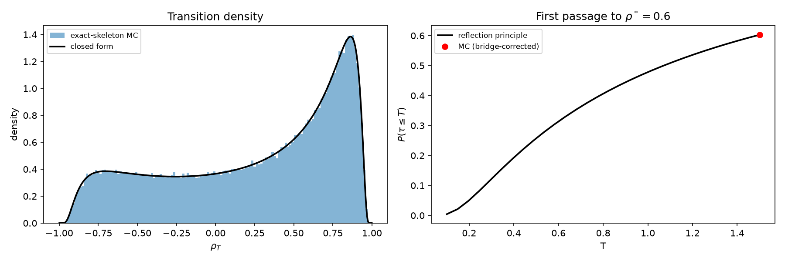
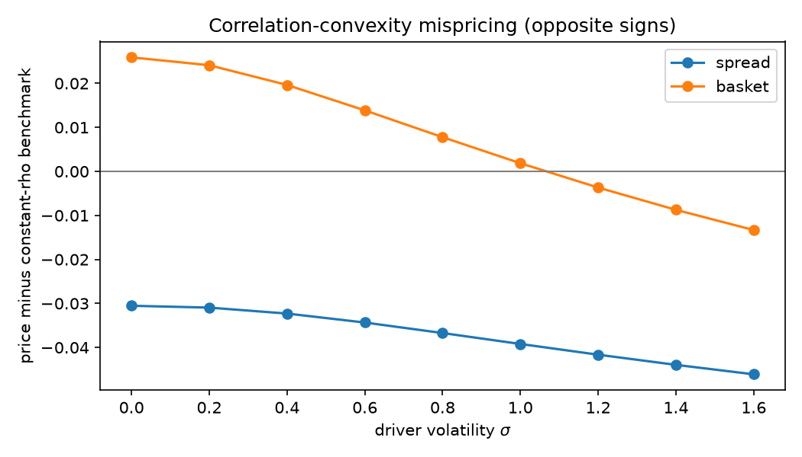
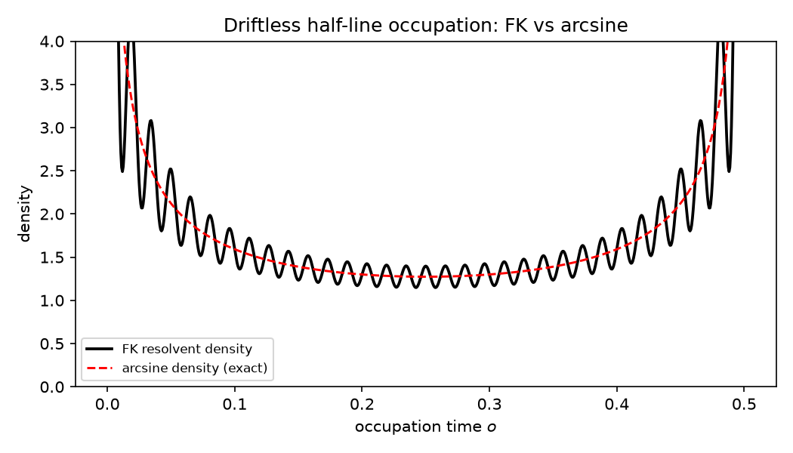

**Mathematics Subject Classification (2020):** 60H10, 60J60, 60J65,
91G20, 91G60.

**JEL classification:** C02, C63, G12, G13.

# Introduction {#sec-introduction}

Correlation is the canonical bounded state variable of multi-asset
finance, and it is empirically stochastic [@teng2016; @driessen2009].
The modeling question is thirty years old and the answers split into two
families, both with structural defects for pricing. Bounded *intrinsic*
diffusions — the Jacobi process of van Emmerich
[@vanemmerich2006; @ackerer2018] — are mean-reverting but have no
closed-form transition density, so likelihoods and prices need spectral
expansions. *Transform* models — correlation as a bounded function of a
Gaussian factor, as in the hyperbolic-tangent model of Teng, Ehrhardt,
and Günther [@teng2016] — have exact marginals by change of variables,
but the transform in use has never been given the path-level laws that
exotic pricing consumes: barrier and one-touch structures under
stochastic correlation are handled by approximation
[@higgins2014], and the first-passage problems of the underlying
drivers are unsolved in closed form outside the Brownian case
[@ricciardi1988; @alili2005].

This paper closes that gap for one particular transform — the one whose
path-level laws *are* closed form. The correlation state is

$$
\rho_t=\sin\theta_t=\frac{X_t}{\sqrt{X_t^{2}+c^{2}}},\qquad
\theta_t=\arctan(X_t/c),\qquad X_t=x_0+\mu t+\sigma W_t,
$$

the sine of the *one-phase Euler phase* of the companion paper
[@onephaseeuler2026], where $\theta_t$ was proved to be the unique
lossless phase coordinate of an affine complex Brownian process. The map
$x\mapsto x/\sqrt{x^{2}+c^{2}}$ is a smooth monotone conjugacy between
the real line and $(-1,1)$; every path property of $X$ therefore
transfers to $\rho$, and the Brownian driver's reflection principle
becomes exact first-passage law for correlation barriers. No Jacobi,
tanh-transformed-OU, or circular model has this, because their drivers'
first-passage problems admit no reflection principle.

The contributions, each verified in the companion notebook
[@onephaseeuler2026, companion notebook therein] and the
reproducibility material of this paper, are:

1. **Exact kernels** (@sec-coordinate, @sec-firstpassage): the
   finite-time transition density, the first-passage CDF and density,
   the perpetual hitting probability, and the two-sided band-exit law of
   $\rho_t$, all in terms of the Gaussian CDF; plus invariance of the
   entire class under Girsanov measure changes with constant correlation
   risk premium.
2. **Exact correlation derivatives** (@sec-derivatives): digital,
   one-touch paid at expiry, one-touch paid at hit — the last a new
   closed form obtained by completing the square in the inverse-Gaussian
   density — and discretely monitored range accruals.
3. **The variance-clock reduction** (@sec-reduction): for two Bachelier
   assets correlated through $\rho_t$, any linear combination is,
   conditionally on the correlation path, Brownian motion with a
   deterministic clock. Joint barrier pricing collapses from three
   drivers to one scalar functional, with a sign theorem: correlation
   risk misprices spread and basket barriers in *opposite* directions.
4. **The full clock law** (@sec-fk): the clock's bounded support turns
   its Feynman–Kac characteristic function into a Fourier series, giving
   deterministic prices with two monitored discretization errors,
   statistically indistinguishable from exact simulation
   ($|z|<1$ in all reported configurations).
5. **Corridor occupation** (@sec-corridor): the same resolvent with an
   indicator potential, after explicit separation of the never-exit
   atom, prices continuous corridor digitals and calls; the driftless
   half-line case reproduces Lévy's arcsine law to $5\times10^{-4}$.
6. **The OU driver and the classification** (@sec-ou): an
   Ornstein–Uhlenbeck driver makes the correlation state mean-reverting
   with exact stationary density; we classify precisely what is kept
   (static laws, clock reduction, resolvent machinery) and what is
   surrendered (reflection-principle hitting laws), and verify the
   $\kappa\to0^{+}$ degeneration into the Brownian results.

@sec-related states the novelty boundary: we do not claim the transform
itself (bounded functions of Gaussian factors are established
[@vanemmerich2006; @teng2016]), nor a new correlation model in the
empirical sense; the claim is the exact path-level and pricing content
of this coordinate, which the audited literature does not contain, and
the classification theorem of @sec-ou. The economic costs —
non-stationarity under the Brownian driver, polynomial approach to the
boundaries $\pm1$ (slower than the tanh model's exponential, the very
objection raised in [@teng2016] against arctan-family maps), and the
exclusion of leverage — are stated where they apply, not hidden.

## Setup and conventions

Throughout, $W$ is standard Brownian motion on a filtered probability
space, $\Phi$ is the standard normal CDF, $c>0$ is the chart scale, and

$$
f(x)=\frac{x}{\sqrt{x^{2}+c^{2}}},\qquad
f^{-1}(\rho)=\frac{c\,\rho}{\sqrt{1-\rho^{2}}},\qquad
\frac{d f^{-1}}{d\rho}=\frac{c}{(1-\rho^{2})^{3/2}} .
$$

Quadratic variation is written $d[W]_t=dt$; no finite-increment identity
is implied. Prices are at time $0$ with constant rate $r\ge0$ under a
chosen pricing measure; @sec-firstpassage shows the exact class is
invariant under the measure changes pricing requires.

# The bounded correlation coordinate {#sec-coordinate}

::: {#def-coordinate}
## Bounded correlation coordinate
Let $X_t=x_0+\mu t+\sigma W_t$ with $\sigma>0$, $c>0$. The *bounded
correlation coordinate* is $\rho_t=f(X_t)$, and $\theta_t=\arctan(X_t/c)$
is its *phase*, so $\rho_t=\sin\theta_t\in(-1,1)$.
:::

The coordinate is not an ad hoc choice: in the companion paper's
classification [@onephaseeuler2026], $\theta_t$ is the *unique*
time-independent lossless phase of an affine complex Brownian process
$1+iX_t/c=\sec\theta_t\,e^{i\theta_t}$, and $r(\theta)=\sec\theta$ is the
polar equation of its supporting line. What the present paper adds is
the financial reading of $\sin\theta$ as a correlation state and the
pricing content that reading enables.

::: {#prp-sde}
## The autonomous correlation SDE
$$
d\rho_t=
\Big[\frac{\mu}{c}(1-\rho_t^{2})^{3/2}
-\frac{3\sigma^{2}}{2c^{2}}\rho_t(1-\rho_t^{2})^{2}\Big]dt
+\frac{\sigma}{c}(1-\rho_t^{2})^{3/2}\,dW_t .
$$
:::
::: {.proof}
Itô's formula with $f'(x)=c^{2}(x^{2}+c^{2})^{-3/2}$,
$f''(x)=-3c^{2}x(x^{2}+c^{2})^{-5/2}$, and $x^{2}+c^{2}=c^{2}/(1-\rho^{2})$.
∎
:::

The diffusion coefficient vanishes like $(1-\rho^{2})^{3/2}$ at the
boundaries — faster than the Jacobi $\sqrt{1-\rho^{2}}$ — so $\pm1$ are
unattainable in finite time (they correspond to $|X_t|=\infty$), and the
coordinate respects correlation's natural state space without parameter
restrictions, unlike the Jacobi family whose Feller condition constrains
parameters [@vanemmerich2006; @teng2016]. The cost: approach to the
boundaries is polynomial, so the model places more mass near strong
correlation regimes than exponential-transform models; see @sec-related.

::: {#thm-density}
## Exact transition density
For $t>0$ and $\rho\in(-1,1)$,
$$
p_t(\rho\mid\rho_0)
=
\frac{c}{(1-\rho^{2})^{3/2}}\,
\frac{1}{\sigma\sqrt{2\pi t}}
\exp\!\Big[-\frac{\big(f^{-1}(\rho)-f^{-1}(\rho_0)-\mu t\big)^{2}}
{2\sigma^{2}t}\Big].
$$
:::
::: {.proof}
Monotone change of variables of the Gaussian law of $X_t$. ∎
:::

This is an exact *finite-time* law in a single closed form. For
contrast, the closed-form density of the tanh-transformed modified-OU
model [@teng2016] is its *stationary* density; its finite-time
transition density is not closed form because its driver has none, and
the Jacobi transition density requires spectral expansions
[@ackerer2018]. @fig-kernels (left) verifies @thm-density against
exact-skeleton simulation.

# First-passage laws under the Brownian driver {#sec-firstpassage}

Write $x(\rho)=f^{-1}(\rho)$ and, for an upper level $\rho^{*}>\rho_0$,
$b=x(\rho^{*})-x(\rho_0)>0$ for the *conjugate barrier distance*.

::: {#thm-firstpassage}
## Exact correlation first-passage law
Let $\tau_\rho=\inf\{t\ge0:\rho_t\ge\rho^{*}\}$. Then
$\tau_\rho=\inf\{t\ge0:X_t\ge x(\rho^{*})\}$ almost surely, and:

**(a)** for $T>0$,
$$
\mathbb P(\tau_\rho\le T)
=
\Phi\!\Big(\frac{\mu T-b}{\sigma\sqrt T}\Big)
+
e^{2\mu b/\sigma^{2}}\,
\Phi\!\Big(-\frac{\mu T+b}{\sigma\sqrt T}\Big);
$$

**(b)** the (possibly defective) hitting-time density is inverse Gaussian,
$$
g_\tau(t)=\frac{b}{\sigma\sqrt{2\pi t^{3}}}
\exp\!\Big[-\frac{(b-\mu t)^{2}}{2\sigma^{2}t}\Big],
\qquad
\int_0^{\infty}g_\tau=\min\!\big(1,e^{2\mu b/\sigma^{2}}\big);
$$

**(c)** the perpetual hitting probability is
$\mathbb P(\tau_\rho<\infty)=1$ for $\mu\ge0$ and
$e^{2\mu b/\sigma^{2}}$ for $\mu<0$;
**(d)** conditional moments for $\mu>0$ are
$\mathbb E[\tau\mid\tau<\infty]=b/\mu$ and
$\operatorname{Var}(\tau\mid\tau<\infty)=b\sigma^{2}/\mu^{3}$.
:::
::: {.proof}
$f$ is strictly increasing, so the events coincide; (a)–(d) are the
reflection-principle facts of drifted Brownian motion
[@borodinsalminen2002, §1.1]. ∎
:::

The two-sided analogue follows from the scale function
$s(x)=e^{-2\mu x/\sigma^{2}}$ ($s(x)=x$ for $\mu=0$): for
$\rho_\ell<\rho_0<\rho_h$,
$\mathbb P(\text{exit at }\rho_h)=
\big(s(x_0)-s(x(\rho_\ell))\big)/\big(s(x(\rho_h))-s(x(\rho_\ell))\big)$.
@fig-kernels (right) verifies (a) against bridge-corrected simulation.

{#fig-kernels}

::: {#prp-measurechange}
## Measure-change invariance
Under any equivalent martingale measure with constant market price of
correlation risk $\lambda$, every law of this section and every price of
@sec-derivatives holds verbatim with $\mu$ replaced by
$\mu^{\mathbb Q}=\mu+\sigma\lambda$.
:::
::: {.proof}
Girsanov with constant $\lambda$ maps drifted Brownian motion to drifted
Brownian motion [@girsanov1960]; the reflection principle and the
conjugate map see only the drift. ∎
:::

Since correlation is not a traded asset, the pricing measure is a choice
parameterized by $\lambda$; @prp-measurechange says the exact-kernel
class is *closed* under that choice. The correlation risk premium
[@driessen2009] enters as one scalar drift parameter, and price
sensitivities to it are closed-form comparative statics (no
re-simulation).

# Correlation derivatives {#sec-derivatives}

All four products below are priced in terms of $\Phi$ — no series, no
transform inversion, no simulation. To our knowledge after the audit of
@sec-related, these are the first closed-form prices for
correlation-barrier and correlation-range payoffs: the tractable
competitors cover European-type payoffs only, and barrier/touch
structures under stochastic correlation have approximations
[@higgins2014].

::: {#prp-digital}
## Digital
$V_{\mathrm{dig}}=e^{-rT}\Phi\!\big((\mu T-b)/(\sigma\sqrt T)\big)$,
paying $\mathbf 1_{\{\rho_T\ge\rho^{*}\}}$ (any $\rho^{*}\in(-1,1)$).
:::

::: {#prp-touch}
## One-touch paid at expiry
$V_{\mathrm{touch}}^{T}=e^{-rT}\,\mathbb P(\tau_\rho\le T)$ with
@thm-firstpassage (a), paying $\mathbf 1_{\{\tau_\rho\le T\}}$ at $T$.
:::

::: {#thm-touchhit}
## One-touch paid at hit — a new closed form
With $\gamma=\sqrt{\mu^{2}+2r\sigma^{2}}$,
$$
V_{\mathrm{touch}}^{\mathrm{hit}}
=
e^{-b(\gamma-\mu)/\sigma^{2}}
\Big[
\Phi\!\Big(\frac{\gamma T-b}{\sigma\sqrt T}\Big)
+
e^{2\gamma b/\sigma^{2}}
\Phi\!\Big(-\frac{\gamma T+b}{\sigma\sqrt T}\Big)
\Big],
$$
paying $1$ at $\tau_\rho$ if $\tau_\rho\le T$.
:::
::: {.proof}
Completing the square,
$(b-\mu t)^{2}/(2\sigma^{2}t)+rt=(b-\gamma t)^{2}/(2\sigma^{2}t)
+b(\gamma-\mu)/\sigma^{2}$, so
$e^{-rt}g_\tau^{(\mu)}(t)=e^{-b(\gamma-\mu)/\sigma^{2}}g_\tau^{(\gamma)}(t)$
and the right side integrates as @thm-firstpassage (a) with drift
$\gamma$. ∎
:::

Consistency limits, enforced as unit tests: $r\to0^{+}$ recovers
@prp-touch undiscounted (both drift signs); $T\to\infty$ recovers the
classical Laplace transform $e^{-b(\gamma-\mu)/\sigma^{2}}$; and
$V_{\mathrm{touch}}^{\mathrm{hit}}\ge V_{\mathrm{touch}}^{T}\ge
V_{\mathrm{dig}}$.

::: {#prp-accrual}
## Discretely monitored range accrual
For monitoring dates $0<t_1<\dots<t_n=T$ and band
$(\rho_\ell,\rho_h)$,
$$
V_{\mathrm{range}}
=
\sum_{i=1}^{n}e^{-rt_i}
\Big[
\Phi\!\Big(\frac{x(\rho_h)-x_0-\mu t_i}{\sigma\sqrt{t_i}}\Big)
-
\Phi\!\Big(\frac{x(\rho_\ell)-x_0-\mu t_i}{\sigma\sqrt{t_i}}\Big)
\Big],
$$
paying $\sum_i\mathbf 1_{\{\rho_\ell\le\rho_{t_i}\le\rho_h\}}$. Either
level may be $\mp1$, recovering one-sided digitals.
:::

Daily monitoring is how range accruals are written, so @prp-accrual is
the practical product; the *continuous* corridor is the harder object
and is solved in @sec-corridor.

The paper notebook reports all prices against bridge-corrected Monte
Carlo (within $2$ standard errors), and plots the one-touch price
against the correlation risk premium $\lambda$ of
@prp-measurechange — a closed-form comparative static that the
approximation literature cannot produce.

# Joint two-asset barriers: the variance-clock reduction {#sec-reduction}

## Model

Two traded forward prices (martingales under the forward measure, so no
drifts appear), correlated through the bounded coordinate:

$$
dF_1=\sigma_1\,dW_1,\qquad
dF_2=\sigma_2\big(\rho_t\,dW_1+\sqrt{1-\rho_t^{2}}\,dW_2\big),
$$

with $\rho_t=f(X_t)$ as before. **Structural assumption:** the
correlation driver $W$ is independent of the asset drivers
$(W_1,W_2)$ — the van Emmerich/Teng construction
[@vanemmerich2006; @teng2016]. The cost is the exclusion of leverage
(correlation does not respond to asset moves); see @sec-related.

::: {#lem-gaussian}
## Conditional Gaussianity
Conditional on the correlation path $\rho_{[0,T]}$, the pair
$(F_1,F_2)$ is Gaussian with deterministic covariance determined by
$\rho_{[0,T]}$.
:::
::: {.proof}
Itô integrals with (conditionally) deterministic integrands are
Gaussian; independence of $W$ makes conditioning free. ∎
:::

::: {#thm-clock}
## Deterministic variance clock
Let $Z=\alpha_1F_1+\alpha_2F_2$ (spread $\alpha=(1,-1)$, basket
$\alpha=(1,1)$), $z_0=\alpha_1F_{1,0}+\alpha_2F_{2,0}$. Conditionally on
$\rho_{[0,T]}$,
$$
Z_t\ \stackrel{\mathrm{law}}{=}\ z_0+B_{v(t)},\qquad
v(t)=\int_0^{t}q(\rho_s)\,ds,
$$
$$
q(\rho)=\alpha_1^{2}\sigma_1^{2}+\alpha_2^{2}\sigma_2^{2}
+2\alpha_1\alpha_2\sigma_1\sigma_2\,\rho .
$$
:::
::: {.proof}
$Z$ is a continuous local martingale with quadratic variation
$\int q(\rho_s)\,ds$, deterministic under conditioning; the
Dambis–Dubins–Schwarz theorem [@karatzasshreve1991, Thm. 3.4.6]
applies. ∎
:::

::: {#cor-scalar}
## Scalar reduction of joint barrier laws
For an upper barrier $d>z_0$,
$$
\mathbb P\!\Big(\sup_{t\le T}Z_t\ge d\ \Big|\ \rho_{[0,T]}\Big)
=
2\Big(1-\Phi\Big(\frac{d-z_0}{\sqrt{v(T;\rho)}}\Big)\Big),
$$
and analogously for lower barriers and the joint law of
$(\sup Z,Z_T)$. Every claim measurable in the running extrema of $Z$
prices as $e^{-rT}\mathbb E_\rho[g(v(T;\rho))]$ with $g$ closed form.
:::

The three-driver pricing problem collapses to the law of one scalar
functional. The notebook verifies the theorem itself, not just its
consequences: a full three-driver simulation with bridge correction
matches the scalar reduction (z-scores $-1.16$, $+1.19$ at two step
sizes), with the reduction's standard error six times smaller — an
effective-dimension reduction, not a relabeling.

::: {#cor-sign}
## Sign theorem: spread vs. basket
The $q$-coefficient of $\rho$ is $2\alpha_1\alpha_2\sigma_1\sigma_2$:
negative for the spread, positive for the basket. Correlation risk
therefore moves spread-barrier and basket-barrier prices in opposite
directions, and constant-correlation pricing misprices the two in
opposite senses.
:::

@fig-mispricing exhibits @cor-sign: the gap between stochastic- and
constant-correlation one-touch prices has opposite signs for spread and
basket across the correlation-volatility range. Since
$v\mapsto 2(1-\Phi(d/\sqrt v))$ changes convexity in $v$, the *sign* of
the Jensen gap is parameter-dependent and is exhibited numerically
rather than asserted as a theorem.

{#fig-mispricing}

Working with forward prices is what makes @thm-clock exact: with
nonzero drifts the running supremum depends on the whole variance path,
not only on $v(T)$.

# The full clock law by Feynman–Kac {#sec-fk}

@cor-scalar prices everything through the law of
$v(T;\rho)=\beta T+\alpha A_T$ with
$\beta=\alpha_1^{2}\sigma_1^{2}+\alpha_2^{2}\sigma_2^{2}$,
$\alpha=2\alpha_1\alpha_2\sigma_1\sigma_2$ and
$A_T=\int_0^T\rho_s\,ds$. The moments of $A_T$ are deterministic
quadratures (Gauss–Hermite over the Gaussian factor, Gauss–Legendre
over the time simplex — the naive square rule has a diagonal ridge; the
triangle-aware rule converges to machine precision). For the full law:

::: {#thm-fk}
## Bounded support Fourier density
Let $u(t,x)=\mathbb E_x[e^{i\xi\int_0^t f(X_s)\,ds}]$. Then
$$
\partial_t u=\tfrac{\sigma^{2}}{2}u_{xx}+\mu u_x+i\xi f(x)\,u,\qquad
u(0,x)=1,
$$
and $\phi(\xi)=u(T,x_0)$ is the characteristic function of $A_T$. Since
$|f|<1$, the support of $A_T$ is bounded in $(-T,T)$, and on $[-T,T]$
the density is
$$
p(a)=\frac{1}{2T}\sum_{k=-\infty}^{\infty}
\phi\!\Big(\frac{k\pi}{T}\Big)e^{-ik\pi a/T}.
$$
:::
::: {.proof}
Feynman–Kac [@kac1949] applies since the potential is bounded; the
Fourier representation is the standard series on a bounded interval. ∎
:::

One PDE solve per Fourier mode (Krylov time integration on a truncated
domain; the Dirichlet localization error is checked by doubling the
margin, cf. [@contvoltchkova2005]). The price is

$$
V_{\mathrm{FK}}
=
e^{-rT}\int_{-T}^{T}g\big(\beta T+\alpha a\big)\,p_K(a)\,da ,
$$

with two monitored discretization errors ($K$, grid). In all reported
configurations the deterministic price is statistically
indistinguishable from the exact-simulation benchmark ($|z|<1$); a
Gamma moment match on the quadrature moments remains as a fast
screening tool whose error against the resolvent price is measured per
parameter set ($-5\times10^{-5}$ to $-2\times10^{-3}$ across the
correlation-volatility range).

# Corridor occupation {#sec-corridor}

The continuous corridor pays on the occupation time
$\mathcal O_T=\int_0^T\mathbf 1_{\{x_\ell\le X_t\le x_h\}}\,dt$ — exactly
the occupation of the correlation band $\{\rho_\ell\le\rho_t\le\rho_h\}$.
The plain corridor bond is linear in $\mathcal O_T$ and prices by
quadrature of Gaussian probabilities (an anchor, not a contribution);
anything nonlinear — a corridor digital
$\mathbf 1_{\{\mathcal O_T\ge\kappa T\}}$ or call
$(\mathcal O_T/T-\kappa)^{+}$ — needs the law.

The resolvent of @thm-fk applies with potential
$i\xi\mathbf 1_{[x_\ell,x_h]}$. Two structural facts drive the
computation:

::: {#prp-atom}
## The never-exit atom
A bounded corridor always has an atom at $\mathcal O_T=T$ (never exit),
computable deterministically by the absorbing-boundary PDE on the
corridor; an unbounded corridor with drift has one in closed form from
@thm-firstpassage (c). At the Fourier nodes $\xi_k=2\pi k/T$ the atom
contributes its mass as a constant ($e^{i\xi_kT}=1$), so it is
subtracted from every mode and the Fourier series represents only the
continuous part.
:::

::: {#thm-arcsine}
## Arcsine anchor
For $\mu=0$, corridor $[0,\infty)$, $x_0=0$, the occupation fraction
follows Lévy's arcsine law
$\mathbb P(\mathcal O_T\le sT)=\frac{2}{\pi}\arcsin\sqrt s$
[@levy1939]. The resolvent pipeline reproduces it: tail probabilities
to $5\times10^{-4}$ (@fig-arcsine).
:::

{#fig-arcsine}

The notebook prices corridor digitals and calls against exact-skeleton
simulation; the residual gap ($\sim7\times10^{-3}$) is fully explained
by two identified opposite-sign biases (simulation overstates occupation
through bridge misses; Fourier truncation biases slightly downward), and
is recorded as such in the reproducibility material — not reported as
statistical agreement.

# The OU driver and the stationarity–tractability classification {#sec-ou}

Replace the driver by
$dX_t=\kappa(\bar x-X_t)\,dt+\sigma\,dW_t$, $\kappa>0$. The correlation
coordinate inherits mean reversion and an exact stationary density
(Gaussian stationary law pushed through $f$), answering the standard
objection to non-stationary correlation models [@teng2016].

::: {#thm-classification}
## Stationarity–tractability classification
For $\rho_t=f(X_t)$ with $X$ a scalar Gaussian factor:

| object | BM driver | OU driver |
|---|---|---|---|
| stationarity | none | exact stationary density |
| transition density | closed form | closed form |
| digital / discrete accrual | closed form | closed form |
| first-passage laws | closed form (reflection) | no closed form; FK resolvent |
| DDS variance clock | exact | exact (driver-agnostic) |
| clock moments / full law | quadrature / FK | quadrature / FK (OU generator) |
| measure change, constant $\lambda$ | $\mu\to\mu+\sigma\lambda$ | $\bar x\to\bar x+\sigma\lambda/\kappa$ |
:::
::: {.proof}
Static rows: OU transitions are Gaussian, and the conjugate map is
deterministic. First-passage row: OU hitting laws admit only series
representations [@ricciardi1988; @alili2005]; hitting probabilities
are path properties and the monotone map cannot repair what the
generator lacks. Clock rows: @thm-clock conditions on the realized
path and never sees the generator. Measure-change row: Girsanov with
constant $\lambda$ shifts the OU drift by a constant, equivalently the
long-run mean. ∎
:::

::: {#cor-frontier}
## The frontier
In this model class, reflection-principle hitting laws and stationarity
are mutually exclusive: a Gaussian factor with a Gaussian stationary law
is not Brownian, and only Brownian motion has reflection-principle
hitting laws. Mean reversion is bought by surrendering closed-form
barrier laws to the resolvent; everything static and everything
clock-based survives.
:::

The $\kappa\to0^{+}$ degeneration anchors the implementation: every OU
formula reproduces its Brownian counterpart (density to $2\times10^{-7}$,
occupation moments to $6\times10^{-8}$), and the OU spread one-touch
price from the resolvent matches exact OU simulation (z $=+0.92$).

# Novelty boundary and related work {#sec-related}

**Established, not claimed.** Bounded correlation as a transform of a
Gaussian factor: van Emmerich [@vanemmerich2006]; tanh of a modified
OU with closed-form *stationary* density and quanto pricing by
conditional Monte Carlo: Teng–Ehrhardt–Günther [@teng2016]; Jacobi
correlation and Jacobi volatility with spectral methods
[@ackerer2018]; circular correlation models with approximate
likelihood [@majumdar2024]; barrier/touch *approximations* under
stochastic (spot–vol) correlation [@higgins2014]; the arctangent map
as a numerical compactification in finance
[@duffiekan1996; @inthoutsnoeijer2021]; arctangent-transformed
Brownian motion as an exact SDE example [@sarkkasolin2019]; Bachelier
pricing context
[@schachermayerteichmann2008; @choi2022; @cme2020]; exact simulation
beyond transform methods [@beskosroberts2005]. The one-phase Euler
chart itself is the companion paper [@onephaseeuler2026].

**What the audit found open, and what is claimed here.** (i) Exact
finite-time kernels and reflection-principle first-passage laws for a
bounded correlation state (@thm-density, @thm-firstpassage) — the
competitors have stationary-only densities, spectral densities, or
approximate ones. (ii) Exact prices for correlation-barrier and
correlation-range payoffs, including the pay-at-hit closed form of
@thm-touchhit (@sec-derivatives, @sec-corridor) — previously
approximation territory. (iii) The scalar variance-clock reduction with
its sign theorem (@thm-clock, @cor-sign) and the deterministic full
clock law (@thm-fk). (iv) The stationarity–tractability classification
(@thm-classification). Teng et al. [@teng2016] considered and
rejected an arctan-family correlation map for its slow polynomial
approach to $\pm1$; we accept that cost explicitly (it is the price of
the reflection principle), and note the rejection concerned a different
member of the family ($(2/\pi)\arctan$ of the factor, not
$\sin\circ\arctan$), and was an estimation argument, not a pricing one.

**Costs and exclusions, stated.** Under the Brownian driver the
coordinate is non-stationary ($\rho_t\to\operatorname{sgn}\mu$ a.s. for
$\mu\neq0$; recurrent extremes for $\mu=0$); the OU driver of
@sec-ou answers this at the cost of @cor-frontier. Boundary
approach is polynomial. The reduction of @sec-reduction excludes
leverage ($W\perp(W_1,W_2)$). Correlation is not traded; prices are
conditional on a chosen risk premium (@prp-measurechange). Estimation
and calibration are deferred, though exact likelihoods are immediate
from @thm-density.

# Conclusion {#sec-conclusion}

One bounded change of variables — the sine of the one-phase Euler phase —
carries Brownian exactness through every level of the stochastic
correlation problem: kernels, first passage, derivative prices, joint
barrier laws, occupation laws, and, with the OU driver, a classified
stationarity frontier. The framework's value is not a new transform but
the closed-form and deterministic content the transform inherits from
the reflection principle and the Feynman–Kac resolvent — content the
tractable literature prices only by approximation.

# Reproducibility {#sec-reproducibility .unnumbered}

All numerical claims are produced by the companion notebook
(`notebooks/phase6_correlation_paper.ipynb`, seed 20260727, runtime
under one minute) from tested repository modules
(`phase6_correlation.py`, `phase6_joint.py`, `phase6_fk.py`,
`phase6_corridor.py`, `phase6_ou.py`; 77 unit tests). Key checks:
transition density and first-passage CDF vs. exact-skeleton Monte Carlo
(@fig-kernels); derivative ordering
$V_{\mathrm{dig}}\le V_{\mathrm{touch}}^{T}\le
V_{\mathrm{touch}}^{\mathrm{hit}}$; full three-driver vs. scalar
reduction; FK price vs. benchmark ($|z|<1$); arcsine tail to
$5\times10^{-4}$; $\kappa\to0^{+}$ anchors; OU price vs. benchmark
($z=-0.14$). Figures and machine-readable checks are in `figures/` and
`tables/` (`verification_summary.csv`).

# References {.unnumbered}

::: {#refs}
:::
