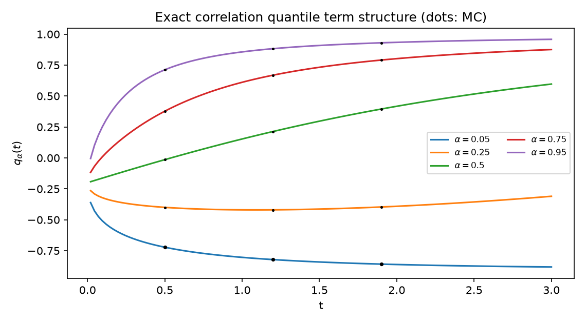
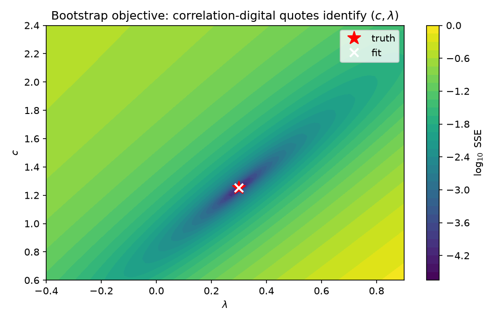

**Mathematics Subject Classification (2020):** 60H10, 60J60, 60J65,
91G20, 91G60.

**JEL classification:** C02, C63, G12, G13.

# Introduction {#sec-introduction}

Bounded stochastic-correlation models stop, almost uniformly, at their
stationary density. The hyperbolic-OU family of @teng2016 calibrates a
histogram; simulation handles the rest. The bounded-factor framework of
the companion papers broke that ceiling for constant driver coefficients:
because $\rho_t=X_t/\sqrt{X_t^2+c^2}$ is a monotone conjugacy of a Gaussian
factor, transition densities, reflection-principle first-passage laws,
corridor occupation laws, and — through Dambis–Dubins–Schwarz (DDS) — the
full clock law underlying spread/basket pricing are available in closed
form or as one-dimensional deterministic quadratures.

This paper asks the natural robustness question: **which of these laws
survive when the driver has deterministic coefficient curves**
$dX_t=\mu(t)\,dt+\sigma(t)\,dW_t$? The question matters because any
term-structure calibration requires time dependence, and because the answer
is not uniform: some layers survive exactly, one survives on a precisely
characterizable class, and one standard tool fails silently.

The contributions are threefold.

1. **Static inheritance** (@sec-static): all finite-dimensional laws are
   the constant-coefficient formulas with $(m(t),v(t))$. This includes the
   exact quantile term structure $q_\alpha(t)=f(m(t)+\sqrt{v(t)}\,
   \Phi^{-1}(\alpha))$, forward-start digitals, discrete range accruals,
   and a bootstrap of $(c,\lambda^{\mathbb Q})$ from digital quotes.
2. **The proportional-drift class** (@sec-proportional):
   $\mu(t)=\lambda\sigma^2(t)$ is exactly the class on which the
   reflection-principle toolkit survives, via DDS collapse to operational
   time; barrier laws depend on $\sigma(\cdot)$ only through $v(T)$.
3. **A Feynman–Kac pitfall** (@sec-pitfall): the backward equation fails
   for occupation functionals off constant coefficients. The failure is
   invisible to marginal checks; we exhibit it numerically, diagnose it,
   and implement the correct forward equation.

Throughout, "exact" means closed form up to elementary special functions or
one-dimensional quadrature; Monte Carlo is used only as benchmark. All
claims carry unit tests (`tests/test_phase7_term_structure.py`, 21 tests)
and a reproducible notebook (seed 20260821). The web-audited novelty
boundary is recorded in `PHASE_7_LITERATURE_REVIEW.md`: closed-form
boundary crossing exists only for linear boundaries and isolated special
families [@durbin1992; @potzelberger2001; @kahale2008], and no audited
competitor publishes exact correlation term structures.

# Setup {#sec-setup}

Let

$$
dX_t=\mu(t)\,dt+\sigma(t)\,dW_t,\qquad X_0=x_0,
$$

with $\mu,\sigma$ deterministic, locally integrable / square-integrable,
and define the mean and variance curves

$$
m(t)=x_0+\int_0^t\mu(s)\,ds,\qquad v(t)=\int_0^t\sigma(s)^2\,ds .
$$

The correlation coordinate is $\rho_t=f(X_t)$ with
$f(x)=x/\sqrt{x^2+c^2}$, $c>0$; its inverse in the conjugate coordinate is
$x(\rho)=c\,\rho/\sqrt{1-\rho^2}$ with Jacobian
$|dx/d\rho|=c(1-\rho^2)^{-3/2}$.

# Static inheritance {#sec-static}

**Theorem (static inheritance).** *For every $t$, $X_t\sim N(m(t),v(t))$;
for every $s<t$, $X_t\mid X_s\sim N(X_s+M_{st},V_{st})$ with
$M_{st}=\int_s^t\mu$, $V_{st}=\int_s^t\sigma^2$. Consequently every price
or law depending on finitely many marginals/transitions of $\rho$ equals
its constant-coefficient counterpart with $(m(t_i),v(t_i))$ substituted.*

Immediate corollaries, each verified against Phase-6 anchors at $10^{-13}$
in the constant limit and against exact-skeleton Monte Carlo within ~1 SE:

- **Transition density**
  $$p_t(\rho\mid\rho_s)=\frac{c}{(1-\rho^2)^{3/2}}\,
  \varphi\!\left(\frac{x(\rho)-x(\rho_s)-M_{st}}{\sqrt{V_{st}}}\right).$$
- **Expiry digitals**: $e^{-rT}\Phi((m(T)-x(\rho^*))/\sqrt{v(T)})$.
- **Forward-start digitals**: conditional on $\rho_s$,
  $$E[1\{\rho_T\ge\rho^*\}\mid\rho_s]
  =\Phi\!\left(\frac{x(\rho_s)+M_{st}-x(\rho^*)}{\sqrt{V_{st}}}\right),$$
  and the tower property over the start marginal closes back to the
  unconditional formula (verified to $10^{-10}$ by Gauss–Hermite).
- **Discrete range accruals**: sum of per-date band probabilities.
- **Quantile term structure**:
  $$q_\alpha(t)=f\big(m(t)+\sqrt{v(t)}\,\Phi^{-1}(\alpha)\big),$$
  continuous and strictly increasing in $\alpha$; MC-checked at fifteen
  $(\alpha,t)$ points to 0.0033 maximum error (@fig-quantiles).

{#fig-quantiles}

**Bootstrap.** Correlation-digital quotes $(T_j,\rho_j^*,\text{price}_j)$
identify $(c,\lambda^{\mathbb Q})$ under the model of @sec-proportional by
two-parameter least squares. On synthetic markets generated at
$(c,\lambda)=(1.25,0.30)$ recovery is exact to $10^{-8}$ and the SSE
landscape is single-funnel (@fig-bootstrap). Identification here is *not*
contradicted by the scale observational equivalence theorem of the
estimation paper: the volatility curve $\sigma(\cdot)$ is exogenous, which
breaks the scaling degeneracy through the time ruler.

{#fig-bootstrap}

# The proportional-drift barrier class {#sec-proportional}

**Theorem (operational-time reduction).** *Suppose
$\mu(t)=\lambda\sigma^2(t)$ a.e. on $[0,T]$ with $\sigma(t)>0$. Then*
$$X_t \;\overset{d}{=}\; x_0+\lambda\,v(t)+B_{v(t)}$$
*for a Brownian motion $B$, and consequently every first-passage,
perpetual-hitting, and band-exit law of the constant-coefficient theory
holds verbatim with calendar time replaced by $u=v(T)$; e.g.*
$$
P(\tau_{\rho^*}\le T)=
\Phi\!\Big(\frac{\lambda u-b}{\sqrt u}\Big)+e^{2\lambda b}
\Phi\!\Big(-\frac{\lambda u+b}{\sqrt u}\Big),
\qquad u=v(T),\quad b=x(\rho^*)-x_0 .
$$

The proof is one line of DDS plus monotonicity of $v$. Two consequences
deserve emphasis.

**Parsimony corollary.** Barrier laws depend on $\sigma(\cdot)$ only
through $u=v(T)$: rescaling the volatility curve leaves them bit-identical
(verified numerically: identical exact CDFs, both bridge-corrected Monte
Carlo benchmarks within 1 SE). The pair $(c,\lambda)$ determines all
barrier prices; $\sigma(\cdot)$ merely warps calendar time.

**Necessity within the catalog.** Off proportionality, constant-level
hitting becomes curved-boundary crossing in operational time, for which
the classical catalog provides series/integral-equation methods but no
closed forms beyond affine boundaries and isolated families [@durbin1992;
@potzelberger2001; @kahale2008]. Proportionality is therefore the only
general deterministic-coefficient class inheriting the full reflection
toolkit; beyond it we state this as a conjecture relative to the catalog.

**Calendar-time cost.** Pay-at-hit discounting maps through $v^{-1}$:
$E[e^{-r\tau}]$ retains a closed form only when $v$ is affine (constant
$\sigma$). This is the honest price of the reduction.

Verification: hitting CDFs against bridge-corrected exact-skeleton
simulation for humped and oscillating curves agree within ~1 SE at two
step sizes (@tab-proportional).

| curve | $u(T)=v(2)$ | exact | MC(100) | MC(400) |
|---|---|---|---|---|
| humped | 2.078244 | 0.67685 | 0.67608 (0.00105) | 0.67628 (0.00105) |
| oscillating, rescaled | 2.078244 | 0.67685 | 0.67766 (0.00105) | 0.67605 (0.00105) |

: Hitting $\rho^*=0.55$ by $T=2$ under the proportional class: identical exact laws for equal integrated variance. {#tbl-proportional}

# A Feynman–Kac pitfall and the correct engine {#sec-pitfall}

The clock characteristic function
$\phi_A(\xi)=E[e^{i\xi A_T}]$, $A_T=\int_0^T f(X_s)\,ds$, was computed in
the companion paper by solving the **backward** equation

$$
\partial_t u=\tfrac12\sigma^2\partial_{xx}u+\mu\partial_xu+i\xi f(x)u,
\qquad u(0,x)=1,
$$

— legitimate there because coefficients were constant. For deterministic
curves the naive extension is **false**.

**Proposition (counterexample).** *Let $\sigma\equiv0$, $\mu(t)=t$. Then
$X_t=x+t^2/2$ deterministically and*

$$
u(t,x)=e^{i\xi(xt+t^3/6)}
$$

*satisfies $\partial_tu=i\xi(x+t^2/2)u$ while the backward equation
demands $\partial_tu=\mu(t)\partial_xu+i\xi xu=i\xi(x+t^2)u$. These differ
whenever $\mu'(t)\ne0$.*

The root cause: the derivation of the backward equation conditions the
future segment on $\mathcal F_{dt}$ and replaces
$E[e^{q\int_{dt}^{t+dt}f}]$ by $u(t,X_{dt})$ — valid iff the propagator is
time-translation invariant, i.e. iff coefficients are constant.

**Correct primitive.** The *forward* Feynman–Kac (Fokker–Planck with
potential) equation for the tilted density $p$,

$$
\partial_tp=\tfrac12\sigma^2(t)p_{xx}-\mu(t)p_x+q(x)p,
\qquad p(0,x)=\delta(x-x_0),
\qquad \phi=\int p(T,x)\,dx ,
$$

is valid unconditionally (it is the forward equation of the tilted
semigroup) and reduces to the familiar object for constant coefficients —
which retro-explains why the pitfall stayed hidden through six phases of
constant-coefficient work.

Implementation: Crank–Nicolson stepping with midpoint-frozen
coefficients, Dirichlet localization, delta bump as a narrow normalized
Gaussian. Verification ladder (@tab-fk):

| check | result |
|---|---|
| constant coefficients vs Phase-6 exponential solver ($\xi=0.7,2.1$) | $2\cdot10^{-4}$ |
| linear potential, variable coefficients vs Gaussian closed form | $4.2\cdot10^{-4}$ |
| spatial convergence (grids 900/1800/3600, $\xi=0.3$) | 1.69e-3 → 4.22e-4 → 1.05e-4 |
| $\phi(0)=1$ under variable curves | $10^{-6}$ |
| margin doubling at fixed $h$ | $<10^{-3}$ |
| bounded map vs MC, $\xi\in\{0.5,1.5,3\}$ | ≤4 SE real & imag |
| $E[A_T]$: PDE central difference vs exact marginal quadrature | $2\cdot10^{-5}$ |

: Verification of the forward-FK solver. {#tab-fk}

For contrast, the *incorrect* backward implementation returned
$\phi(0.5)=0.9060+0.0428j$ against truth $0.9094+0.0651j$ and implied
$E[A_T]=0.0892$ against the exact $0.13454$. The real parts nearly agree;
the damage concentrates in the path-dependent imaginary structure — which
is why marginal-only validation would have certified the wrong solver.

# Related literature {#sec-related}

Static inheritance rests on textbook Gaussianity; our contribution is its
systematic organization into pricing objects for a bounded state,
including the quantile term structure absent from the audited corpus
(Teng–Ehrhardt–Günther and successors calibrate stationary densities;
Wishart multi-curve models approximate). The proportional-drift class is
new as a classification; DDS itself and curved-boundary numerics are
classical [@durbin1992; @potzelberger2001; @kahale2008]. The FK pitfall
appears unpublished: standard references state Feynman–Kac for autonomous
generators or handle time-dependence by state-space augmentation, and the
numerical literature on moving-boundary/occupation problems does not flag
the failure mode demonstrated here.

# Conclusion {#sec-conclusion}

Deterministic coefficient curves split the exact-law program cleanly:
finite-dimensional laws inherit fully; reflection laws survive on the
proportional-drift class and collapse to a clock; and the occupation-
transform engine must be rebuilt on the forward equation. All three pieces
are implemented, unit-tested, and Monte Carlo-verified, providing the
platform on which the companion papers build Fourier pricing (Phase 8),
exact estimation (Phase 9), matrix-valued extensions (Phase 10), Lévy
drivers (Phase 11), and pegged-asset economics (Phase 12).

# Reproducibility {#sec-repro}

Environment: conda `phase3-paper` (Python 3.12.13, numpy 2.5.1,
scipy 1.18.0, matplotlib 3.11.1). Notebook:
`notebooks/phase7_term_structure.ipynb` (executed clean, ~21 s, seed
20260821); builder `notebooks/build_phase7_term_structure.py`; module
`phase7_term_structure.py`; tests `tests/test_phase7_term_structure.py`
(21/21). Figures regenerate deterministically from the notebook.
