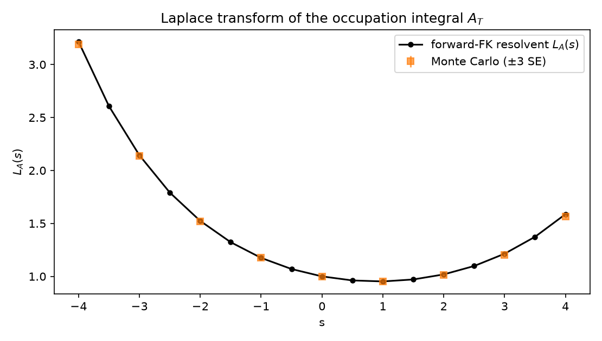
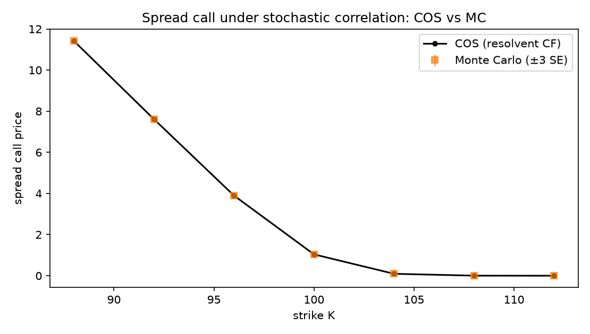
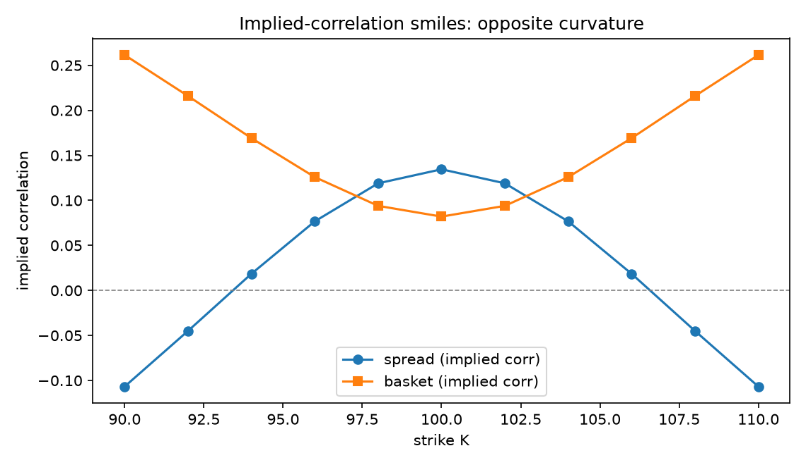

**Mathematics Subject Classification (2020):** 91G20, 91G60, 65C05,
60H10.

**JEL classification:** G12, G13, C63.

# Introduction {#sec-introduction}

Spread and basket options are the canonical multi-asset derivatives, and
their pricing under *stochastic* correlation is an unsolved convenience:
the audited multi-asset Fourier machinery — two-dimensional cosine
expansions [@ruijter2012], tensor-train decompositions [@cosTT2026],
canonical-polyadic compression — all presuppose a known **joint**
characteristic function of the asset prices, and no stochastic-correlation
model in the audited corpus supplies one; practitioners fall back on Monte
Carlo or lower-bound approximations. Stochastic-correlation models
themselves [@teng2016] price quantos by conditional simulation around
Black–Scholes.

This paper closes the gap for the bounded-factor model. The key identity is
that conditional Gaussianity plus DDS reduce $Z_T$ to a Gaussian mixture
whose mixing variable — the occupation integral $A_T=\int_0^T\rho_sds$ —
has bounded support. The Laplace transform $L_A(s)=E[e^{-sA_T}]$ therefore
exists for every real $s$, is computed by a single Feynman–Kac solve per
mode with a *real* (non-oscillatory) potential, and assembles into an exact
one-dimensional characteristic function for $Z_T$. Everything European
about spreads and baskets becomes deterministic.

Contributions:

1. the exact global transform $\phi_Z$ (@sec-cf);
2. two cross-validated deterministic pricers: resolvent+COS and
   clock-density quadrature (@sec-pricing);
3. semi-analytic delta/gamma/vegas (@sec-greeks);
4. the implied-correlation smile geometry: symmetric smiles, opposite
   curvature, ATM level $=E[A_T]$ (@sec-smiles).

# Model and the exact transform {#sec-cf}

## Setup

$$
dF_1=\sigma_1\,dW_1,\qquad
dF_2=\sigma_2(\rho_t\,dW_1+\sqrt{1-\rho_t^2}\,dW_2),
$$

$\rho_t=f(X_t)=X_t/\sqrt{X_t^2+c^2}$, $dX=\mu\,dt+\sigma\,dW$, with the
correlation driver independent of $(W_1,W_2)$. For weights
$(\alpha_1,\alpha_2)$ define

$$
Z=\alpha_1F_1+\alpha_2F_2,\qquad
\beta=\alpha_1^2\sigma_1^2+\alpha_2^2\sigma_2^2,\qquad
\alpha=2\alpha_1\alpha_2\sigma_1\sigma_2 .
$$

## Theorem (exact one-dimensional characteristic function)

*Conditional on the correlation path,* $Z_T\mid\rho\sim N(z_0,v)$ *with*
$v=\beta T+\alpha A_T$. *Consequently*

$$
\phi_Z(u):=E\big[e^{-rT}e^{iuZ_T}\big]
=e^{-rT}e^{iuz_0-\frac12u^2\beta T}\;L_A\!\Big(\frac{\alpha u^2}{2}\Big),
\qquad L_A(s)=E\big[e^{-sA_T}\big],
$$

*and $L_A$ is given by the forward Feynman–Kac resolvent of the driver
with potential $-sf(x)$.*

Because $|A_T|<T$, $0<L_A(s)\le e^{|s|T}$ for all real $s$: no moment
explosion bounds the inversion strip, in contrast with unbounded-variance
models. The real potential makes each evaluation numerically gentler than
an oscillatory solve. Cross-validation: at three frequencies the resolvent
route and the clock-density route (integrating $e^{-u^2\alpha a/2}$ against
the truncated-Fourier density of $A_T$) agree to $10^{-5}$
(@fig-mgf).

{#fig-mgf}

# Deterministic pricing {#sec-pricing}

## Route 1: resolvent + COS

With truncation band $[a,b]=z_0\pm\kappa\sqrt{\beta T+|\alpha|T}$ and modes
$\theta_k=k\pi/(b-a)$, the payoff coefficients of the call are derived for
**arbitrary strike position relative to the band**:

$$
G_k=\int_a^b(z-K)^+\cos(\theta_k(z-a))\,dz=
\begin{cases}
\dfrac{(-1)^k-\cos(\theta_k(K-a))}{\theta_k^2}, & K\in[a,b],\\[2ex]
\dfrac{(-1)^k-1}{\theta_k^2},\quad G_0=\dfrac{(b-K)^2-(a-K)^2}{2}, & K<a,
\end{cases}
$$

with the standard half-weight convention on $k=0$. Strikes above the band
raise a configuration error rather than returning garbage.

## Route 2: clock-density quadrature

$$
V=e^{-rT}\int Bachelier\big(z_0,\ \beta T+\alpha a,\ K\big)\,
p_{A_T}(a)\,da,
$$

with $p_{A_T}$ the Milestone-4 Fourier density built from oscillating
frequencies only ($|\phi_A(\xi)|\le1$). This route avoids the exponential
tilting that makes large-|$s|$ resolvent evaluations delicate, and is the
robust default at extreme moneyness.

Cross-validation: routes agree to $<2\cdot10^{-4}$; COS converges
spectrally in mode count (64→128 modes differ by $10^{-5}$); put–call
parity holds to $10^{-8}$; the deterministic-clock limit reproduces
closed-form Bachelier to $10^{-6}$. Against conditional-Gaussian Monte
Carlo (200k paths), all strikes 88–112 sit within ~1 SE (@tab-mc,
@fig-cosmc).

| K | COS | MC (SE) |
|---|---|---|
| 88 | 11.414795 | 11.413487 (0.0059) |
| 92 | 7.612942 | 7.611496 (0.0059) |
| 96 | 3.898779 | 3.896773 (0.0055) |
| 100 | 1.038546 | 1.037599 (0.0035) |
| 104 | 0.093861 | 0.093752 (0.0010) |
| 108 | 0.003107 | 0.002963 (0.00016) |

: Spread calls under stochastic correlation: COS vs Monte Carlo. {#tab-mc}

{#fig-cosmc}

# Semi-analytic Greeks {#sec-greeks}

With $g(v)$ the undiscounted Bachelier call in variance $v$,
$d=(z_0-K)/\sqrt v$:

$$
\Delta=E[\Phi(d)],\qquad
\Gamma=E\!\left[\frac{\varphi(d)}{\sqrt v}\right],\qquad
\text{vega}_{\sigma_i}=E\!\left[\frac{\varphi(d)}{2\sqrt v}\,
\frac{\partial v}{\partial\sigma_i}\right],
$$

with $\partial v/\partial\sigma_1=2\alpha_1^2\sigma_1T+2\alpha_1\alpha_2
\sigma_2 A_T$ and symmetrically for $\sigma_2$ — all expectations against
the exact clock density. Finite-difference checks agree to $\le10^{-4}$
(unit suite); notebook tables agree at six decimals.

# Implied-correlation smiles {#sec-smiles}

Inverting constant-correlation Bachelier quotes against the stochastic-
correlation price produces the model's falsifiable signature
(@fig-smiles):

1. both spread and basket smiles are **exactly symmetric** in moneyness
   (linear slope zero to machine precision) — a consequence of the
   variance-mixture structure with no drift in $Z$;
2. curvatures are **opposite**: spread $-2.385\times10^{-3}$, basket
   $+1.770\times10^{-3}$. Mechanism: variance mixtures fatten tails;
   higher wing variance maps to *lower* implied correlation for spreads
   (price decreasing in $\rho$) and *higher* for baskets;
3. ATM implied correlations recover $E[A_T]=0.1345$ exactly — a direct,
   assumption-light read-out of the occupation mean.

This extends the sign corollary of the companion paper from barrier prices
to full smile geometry.

{#fig-smiles}

# Related literature {#sec-related}

The COS method is due to @fang2008; multidimensional extensions
[@ruijter2012] and their tensor-compressed successors [@cosTT2026]
require joint characteristic functions and target Lévy/affine model
classes without stochastic correlation. Spread-option formulas in the
lognormal/Lévy world (Caldana–Fusai lineage) likewise assume fixed
dependence. On the model side, the audited stochastic-correlation
literature [@teng2016] offers conditional Monte Carlo only. Our
contribution — reducing the dependence uncertainty to a bounded scalar
occupation integral whose Laplace transform is globally defined — has no
audited counterpart.

# Conclusion {#sec-conclusion}

Boundedness is not merely a mathematical convenience: it is what makes the
dependence uncertainty *transformable*. One sparse PDE solve per mode
yields European spread/basket prices, Greeks, and smile geometry at Monte
Carlo accuracy, deterministically.

# Reproducibility {#sec-repro}

Environment: conda `phase3-paper` (Python 3.12.13, numpy 2.5.1, scipy
1.18.0). Notebook `notebooks/phase8_cos_vanillas.ipynb` (~173 s, seed
20260821); module `phase8_cos.py`; tests `tests/test_phase8_cos.py`
(14/14).
