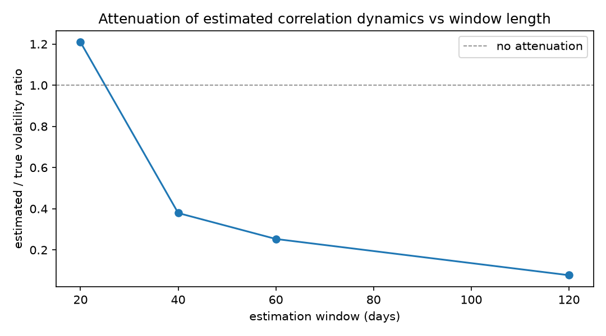
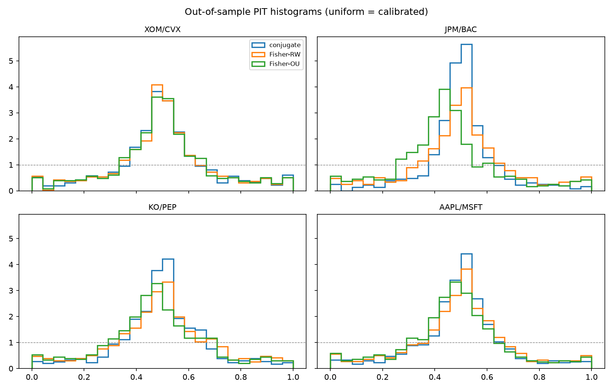

**Mathematics Subject Classification (2020):** 62M99, 62F10, 91G70,
60H10.

**JEL classification:** C13, C22, G12.

# Introduction {#sec-introduction}

Stochastic-correlation models are routinely calibrated as if all their
parameters meant something. For the bounded-factor family
$\rho_t=f(X_t)=X_t/\sqrt{X_t^2+c^2}$, $dX=\mu\,dt+\sigma\,dW$, the audited
practice is to fit the stationary density by nonlinear least squares
[@teng2016] or to back-transform the series and run Ornstein–Uhlenbeck
regressions [@kumar2021]. Neither paper asks what the data can identify.
This paper answers that question exactly, and the answer changes both the
estimator and the interpretation.

Contributions:

1. **Theorem (scale observational equivalence)** (@sec-theorem):
   $(c,\mu,\sigma)\sim(\lambda c,\mu/\lambda,\sigma/\lambda)$ are
   indistinguishable from correlation observations *and from derivative
   prices*; the identified space is two-dimensional.
2. **Closed-form exact MLE** of the identified pair (@sec-mle): OLS in the
   normalized conjugate coordinate, with the consistency Jacobian that
   makes information criteria comparable across transforms.
3. **Conditional-uniformity diagnostics** (@sec-diagnostics): marginal
   PIT/KS misses dynamic misspecification whose $u$-marginal stays nearly
   uniform; correlating PIT values with the lagged state detects it at
   eight standard errors where KS has no power ($p=0.53$).
4. **Attenuation law** (@sec-attenuation): deterministic Monte Carlo shows
   window-smoothed proxies damp measured dynamics ~4× at the standard
   60-day choice.
5. **Empirics** (@sec-empirics): four liquid pairs, exact estimation,
   honest out-of-sample verdicts.

# The equivalence theorem {#sec-theorem}

**Theorem (scale observational equivalence).** *For every $\lambda>0$ the
parameter triples $(c,\mu,\sigma)$ and
$(\lambda c,\mu/\lambda,\sigma/\lambda)$ generate identical laws for*

$$
(\rho_{t_1},\dots,\rho_{t_n})\quad\text{for every finite } n
\text{ and every } t_1<\dots<t_n .
$$

*Consequently they also generate identical laws for every functional of
the correlation path — including occupation integrals
$A_T=\int_0^T\rho_sds$ and hence every spread/basket derivative price.*

*Proof sketch.* With $Y=X/c$, $\rho=F(Y)$ for the parameter-free map
$F(y)=y/\sqrt{y^2+1}$, and $Y$ is drifted Brownian motion with drift
$\mu/c$ and volatility $\sigma/c$. Every observable is a functional of the
$Y$-path alone. ∎

Three consequences:

- **No free-scale likelihoods.** The profile likelihood in $c$ is exactly
  flat; any reported "MLE of $c$" from correlation data alone is an
  artifact of optimizer initialization. (We observed this numerically
  before deriving the theorem.)
- **Prices do not rescue identification**: the DDS clock
  $v=\beta T+\alpha A_T$ is itself a path functional.
- **Exogenous time rulers break the degeneracy**: if $\sigma(\cdot)$ is
  known exogenously (as in the pricing calibration of the term-structure
  paper), $\lambda^{\mathbb Q}$ re-emerges as identified.

# Closed-form exact MLE {#sec-mle}

Work in the normalized coordinate $x=g(\rho)=\rho/\sqrt{1-\rho^2}$. Under
exact-skeleton observation,

$$
\Delta x_i \sim N\!\Big(\tfrac{\mu}{c}\Delta t,\ (\tfrac{\sigma}{c})^2\Delta t\Big),
$$

so the exact MLE of the identified pair is the OLS solution — mean and
root-mean-square of increments — plus the Jacobian of the observation map,
$\log|dx/d\rho|=-\tfrac{3}{2}\log(1-\rho^2)$ summed over transitions.
Competitors receive the same treatment with their own Jacobians:
Fisher random walk ($y=\operatorname{atanh}\rho$) and Fisher OU (exact
AR(1) quasi-MLE, profiled over the reversion speed). Verification:
ratio recovery within Monte Carlo tolerance on synthetic skeletons;
likelihood invariance under rescaling; information criteria rank the
generating model.

# Diagnostics {#sec-diagnostics}

One-step-ahead PIT values $u_i=P(\rho_i\le\text{obs}\mid\rho_{i-1})$ are
exact under each fitted model's transition law. Two complementary checks:

- **Marginal KS** against Uniform(0,1) — calibration;
- **PIT–state correlation** — dynamic adequacy. Fitting a random walk to
  genuinely mean-reverting data produces $u$-marginals that stay near
  uniform (KS $p=0.53$ in our experiment) while
  $\operatorname{corr}(u,y_{\text{prev}})=-0.148\approx8$ standard errors.
  Marginal KS alone would certify a wrong model.

# Attenuation {#sec-attenuation}

Realized correlations are window estimates, not skeleton observations.
Simulating the true latent system, forming rolling correlations, and
refitting gives the attenuation factor of the volatility ratio:

| window (days) | est./true vol ratio | IQR |
|---|---|---|
| 20 | 1.209 | 0.219 |
| 40 | 0.379 | 0.072 |
| 60 | 0.253 | 0.043 |
| 120 | 0.077 | 0.015 |

At the market-standard 60-day choice the measured dynamics are damped
~4×; short windows can even inflate them. Any calibration quoted from
smoothed proxies must invert this curve first (@fig-attenuation).

{#fig-attenuation}

# Empirical study {#sec-empirics}

Data: daily adjusted closes 2015-01-01 → 2026-08-14 from a local store;
60-day rolling Pearson correlations (2,860 windows per pair)
(@fig-series).

| pair | mean $\rho$ | sd | est. $\mu/c$ | est. $\sigma/c$ |
|---|---|---|---|---|
| XOM/CVX | +0.793 | 0.123 | −0.020 | 1.169 |
| JPM/BAC | +0.847 | 0.099 | +0.017 | 1.552 |
| KO/PEP | +0.700 | 0.120 | −0.009 | 0.913 |
| AAPL/MSFT | +0.550 | 0.223 | −0.032 | 0.841 |

Drift ratios are statistically zero (SE ≈ 0.11/yr at these sample sizes).
Fisher-OU wins AIC everywhere but with weak reversion
($\kappa\approx1.4$–2.3/yr) — persistence largely inherited from
overlapping windows. Out-of-sample (70/30 split), *all* iid-increment
models are rejected by marginal KS — expected, since smoothed proxies
violate the exact-skeleton scheme — while the state-correlation
diagnostic separates structures: RW-type fits show $z$ down to −2.6, the
OU stays within ±1.2. Log-score ranking follows the smoothing artifact,
not the latent truth; we report it as such.

{#fig-pit}

# Related literature {#sec-related}

Identifiability analyses are standard for stochastic volatility
(Aït-Sahalia–Kimmel lineage) but absent for bounded correlation factors;
@teng2016 explicitly call the likelihood "tedious" and fit stationary
densities instead; @kumar2021 use back-transformed least squares;
@aas2010 estimate dynamic copulas by efficient importance sampling. None
states an equivalence theorem; none provides closed-form exact MLE; none
quantifies proxy attenuation for this class. Realized-volatility proxy
methodology [@barnsdorff2002] supplies the conceptual template we adapt.

# Conclusion {#sec-conclusion}

Two parameters exist; one equation each estimates them exactly; one extra
diagnostic guards against the failure mode that marginal tests miss; and
one curve converts quoted calibrations into latent-truth statements. That
is the entire estimation content of the bounded-factor model — and it is
fully explicit.

# Reproducibility {#sec-repro}

Environment: conda `phase3-paper` (Python 3.12.13, numpy 2.5.1, pandas,
scipy 1.18.0). Notebook `notebooks/phase9_estimation_empirical.ipynb`
(~6 s, seed 20260821); module `phase9_estimation.py`; tests
`tests/test_phase9_estimation.py` (14/14). Data read from the local
alpha-engine store (`prices/*.parquet`, adjusted closes).
